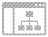

## Azure

| Include | Command  | Icon |
|--|--|--|
|`!include <azure/AIMachineLearning/AzureBatchAI.puml>`|`AzureBatchAI`||
|`!include <azure/AIMachineLearning/AzureBotService.puml>`|`AzureBotService`||
|`!include <azure/AIMachineLearning/MicrosoftGenomics.puml>`|`MicrosoftGenomics`||
|`!include <azure/AIMachineLearning/AzureMachineLearningService.puml>`|`AzureMachineLearningService`||
|`!include <azure/AIMachineLearning/AzureMachineLearningStudio.puml>`|`AzureMachineLearningStudio`||
|`!include <azure/AIMachineLearning/AzureCognitiveServices.puml>`|`AzureCognitiveServices`||
|`!include <azure/Databases/AzureCosmosDb.puml>`|`AzureCosmosDb`||
|`!include <azure/Databases/AzureDatabaseForMariaDB.puml>`|`AzureDatabaseForMariaDB`||
|`!include <azure/Databases/AzureSqlStretchDatabase.puml>`|`AzureSqlStretchDatabase`||
|`!include <azure/Databases/AzureSqlDataWarehouse.puml>`|`AzureSqlDataWarehouse`||
|`!include <azure/Databases/AzureDataFactory.puml>`|`AzureDataFactory`||
|`!include <azure/Databases/AzureRedisCache.puml>`|`AzureRedisCache`||
|`!include <azure/Databases/AzureDatabaseForPostgreSQL.puml>`|`AzureDatabaseForPostgreSQL`||
|`!include <azure/Databases/AzureDatabaseForMySQL.puml>`|`AzureDatabaseForMySQL`||
|`!include <azure/Databases/AzureSqlDatabase.puml>`|`AzureSqlDatabase`||
|`!include <azure/DevOps/AzureArtifacts.puml>`|`AzureArtifacts`||
|`!include <azure/DevOps/AzureRepos.puml>`|`AzureRepos`||
|`!include <azure/DevOps/AzureDevOps.puml>`|`AzureDevOps`||
|`!include <azure/DevOps/AzureTestPlans.puml>`|`AzureTestPlans`||
|`!include <azure/DevOps/AzureBoards.puml>`|`AzureBoards`||
|`!include <azure/DevOps/AzureDevTestLabs.puml>`|`AzureDevTestLabs`||
|`!include <azure/DevOps/AzureLabServices.puml>`|`AzureLabServices`||
|`!include <azure/DevOps/AzurePipelines.puml>`|`AzurePipelines`||
|`!include <azure/DevOps/AzureApplicationInsights.puml>`|`AzureApplicationInsights`||
|`!include <azure/Identity/AzureActiveDirectoryDomainServices.puml>`|`AzureActiveDirectoryDomainServices`||
|`!include <azure/Identity/AzureActiveDirectory.puml>`|`AzureActiveDirectory`||
|`!include <azure/Identity/AzureActiveDirectoryB2C.puml>`|`AzureActiveDirectoryB2C`||
|`!include <azure/Security/AzureSentinel.puml>`|`AzureSentinel`||
|`!include <azure/Security/AzureKeyVault.puml>`|`AzureKeyVault`||
|`!include <azure/General/Azure.puml>`|`Azure`||
|`!include <azure/Web/AzureAPIManagement.puml>`|`AzureAPIManagement`||
|`!include <azure/Web/AzureSearch.puml>`|`AzureSearch`||
|`!include <azure/Web/AzureSignalRService.puml>`|`AzureSignalRService`||
|`!include <azure/Web/AzureWebApp.puml>`|`AzureWebApp`||
|`!include <azure/Web/AzureCDN.puml>`|`AzureCDN`||
|`!include <azure/Integration/AzureServiceBus.puml>`|`AzureServiceBus`||
|`!include <azure/Integration/AzureEventGrid.puml>`|`AzureEventGrid`||
|`!include <azure/Integration/AzureLogicApps.puml>`|`AzureLogicApps`||
|`!include <azure/Networking/AzureTrafficManager.puml>`|`AzureTrafficManager`||
|`!include <azure/Networking/AzureVPNGateway.puml>`|`AzureVPNGateway`||
|`!include <azure/Networking/AzureDNS.puml>`|`AzureDNS`||
|`!include <azure/Networking/AzureFrontDoorService.puml>`|`AzureFrontDoorService`||
|`!include <azure/Networking/AzureAzureDDoSProtection.puml>`|`AzureAzureDDoSProtection`||
|`!include <azure/Networking/AzureApplicationGateway.puml>`|`AzureApplicationGateway`||
|`!include <azure/Networking/AzureVirtualNetwork.puml>`|`AzureVirtualNetwork`||
|`!include <azure/Networking/AzureVirtualWAN.puml>`|`AzureVirtualWAN`||
|`!include <azure/Networking/AzureExpressRoute.puml>`|`AzureExpressRoute`||
|`!include <azure/Networking/AzureLoadBalancer.puml>`|`AzureLoadBalancer`||
|`!include <azure/Management/AzureManagementGroups.puml>`|`AzureManagementGroups`||
|`!include <azure/Management/AzureResourceGroups.puml>`|`AzureResourceGroups`||
|`!include <azure/Management/AzureSubscription.puml>`|`AzureSubscription`||
|`!include <azure/Management/AzureLogAnalytics.puml>`|`AzureLogAnalytics`||
|`!include <azure/Management/AzureBackup.puml>`|`AzureBackup`||
|`!include <azure/Management/AzureManagedApplications.puml>`|`AzureManagedApplications`||
|`!include <azure/Management/AzureScheduler.puml>`|`AzureScheduler`||
|`!include <azure/Management/AzurePolicy.puml>`|`AzurePolicy`||
|`!include <azure/Management/AzureMonitor.puml>`|`AzureMonitor`||
|`!include <azure/Management/AzureSiteRecovery.puml>`|`AzureSiteRecovery`||
|`!include <azure/Management/AzureBlueprints.puml>`|`AzureBlueprints`||
|`!include <azure/Management/AzureAutomation.puml>`|`AzureAutomation`||
|`!include <azure/Storage/AzureStorSimple.puml>`|`AzureStorSimple`||
|`!include <azure/Storage/AzureManagedDisks.puml>`|`AzureManagedDisks`||
|`!include <azure/Storage/AzureBlobStorage.puml>`|`AzureBlobStorage`||
|`!include <azure/Storage/AzureDiskStorage.puml>`|`AzureDiskStorage`||
|`!include <azure/Storage/AzureDataBox.puml>`|`AzureDataBox`||
|`!include <azure/Storage/AzureStorage.puml>`|`AzureStorage`||
|`!include <azure/Storage/AzureQueueStorage.puml>`|`AzureQueueStorage`||
|`!include <azure/Storage/AzureNetAppFiles.puml>`|`AzureNetAppFiles`||
|`!include <azure/Storage/AzureDataLakeStorage.puml>`|`AzureDataLakeStorage`||
|`!include <azure/Storage/AzureFileStorage.puml>`|`AzureFileStorage`||
|`!include <azure/Compute/AzureBatch.puml>`|`AzureBatch`||
|`!include <azure/Compute/AzureServiceFabric.puml>`|`AzureServiceFabric`||
|`!include <azure/Compute/AzureAppService.puml>`|`AzureAppService`||
|`!include <azure/Compute/AzureVirtualMachineScaleSet.puml>`|`AzureVirtualMachineScaleSet`||
|`!include <azure/Compute/AzureVirtualMachine.puml>`|`AzureVirtualMachine`||
|`!include <azure/Compute/AzureFunction.puml>`|`AzureFunction`||
|`!include <azure/InternetOfThings/AzureIoTHub.puml>`|`AzureIoTHub`||
|`!include <azure/InternetOfThings/AzureMaps.puml>`|`AzureMaps`||
|`!include <azure/InternetOfThings/AzureDigitalTwins.puml>`|`AzureDigitalTwins`||
|`!include <azure/InternetOfThings/AzureTimeSeriesInsights.puml>`|`AzureTimeSeriesInsights`||
|`!include <azure/InternetOfThings/AzureIoTCentral.puml>`|`AzureIoTCentral`||
|`!include <azure/InternetOfThings/AzureIoTEdge.puml>`|`AzureIoTEdge`||
|`!include <azure/Mobile/AzureMobileApp.puml>`|`AzureMobileApp`||
|`!include <azure/Mobile/AzureNotificationHubs.puml>`|`AzureNotificationHubs`||
|`!include <azure/Containers/AzureWebAppForContainers.puml>`|`AzureWebAppForContainers`||
|`!include <azure/Containers/AzureServiceFabricMesh.puml>`|`AzureServiceFabricMesh`||
|`!include <azure/Containers/AzureContainerInstance.puml>`|`AzureContainerInstance`||
|`!include <azure/Containers/AzureKubernetesService.puml>`|`AzureKubernetesService`||
|`!include <azure/Containers/AzureContainerRegistry.puml>`|`AzureContainerRegistry`||
|`!include <azure/Analytics/AzureStreamAnalytics.puml>`|`AzureStreamAnalytics`||
|`!include <azure/Analytics/AzureAnalysisServices.puml>`|`AzureAnalysisServices`||
|`!include <azure/Analytics/AzureHDInsight.puml>`|`AzureHDInsight`||
|`!include <azure/Analytics/AzureDataExplorer.puml>`|`AzureDataExplorer`||
|`!include <azure/Analytics/AzureDataCatalog.puml>`|`AzureDataCatalog`||
|`!include <azure/Analytics/AzureDatabricks.puml>`|`AzureDatabricks`||
|`!include <azure/Analytics/AzureDataLakeAnalytics.puml>`|`AzureDataLakeAnalytics`||
|`!include <azure/Analytics/AzureEventHub.puml>`|`AzureEventHub`||
|`!include <azure/Media/AzureMediaServices.puml>`|`AzureMediaServices`||

## Cloud Insight

| Include | Command  | Icon |
|--|--|--|
|`!include <cloudinsight/cacti>`|`<$cacti>`||
|`!include <cloudinsight/plus>`|`<$plus>`||
|`!include <cloudinsight/elasticsearch>`|`<$elasticsearch>`||
|`!include <cloudinsight/bi>`|`<$bi>`||
|`!include <cloudinsight/dashboard>`|`<$dashboard>`||
|`!include <cloudinsight/bell>`|`<$bell>`||
|`!include <cloudinsight/aliyun>`|`<$aliyun>`||
|`!include <cloudinsight/server>`|`<$server>`||
|`!include <cloudinsight/docker>`|`<$docker>`||
|`!include <cloudinsight/supervisord>`|`<$supervisord>`||
|`!include <cloudinsight/openstack>`|`<$openstack>`||
|`!include <cloudinsight/desktop>`|`<$desktop>`||
|`!include <cloudinsight/download>`|`<$download>`||
|`!include <cloudinsight/bearychat>`|`<$bearychat>`||
|`!include <cloudinsight/python>`|`<$python>`||
|`!include <cloudinsight/ci>`|`<$ci>`||
|`!include <cloudinsight/php_fpm>`|`<$php_fpm>`||
|`!include <cloudinsight/ruby>`|`<$ruby>`||
|`!include <cloudinsight/x>`|`<$x>`||
|`!include <cloudinsight/ci-large>`|`<$ci-large>`||
|`!include <cloudinsight/question>`|`<$question>`||
|`!include <cloudinsight/mesos>`|`<$mesos>`||
|`!include <cloudinsight/listalt>`|`<$listalt>`||
|`!include <cloudinsight/file>`|`<$file>`||
|`!include <cloudinsight/disable>`|`<$disable>`||
|`!include <cloudinsight/overview>`|`<$overview>`||
|`!include <cloudinsight/java>`|`<$java>`||
|`!include <cloudinsight/haproxy>`|`<$haproxy>`||
|`!include <cloudinsight/user>`|`<$user>`||
|`!include <cloudinsight/linux>`|`<$linux>`||
|`!include <cloudinsight/apache>`|`<$apache>`||
|`!include <cloudinsight/cog>`|`<$cog>`||
|`!include <cloudinsight/point>`|`<$point>`||
|`!include <cloudinsight/nagios>`|`<$nagios>`||
|`!include <cloudinsight/sqlserver>`|`<$sqlserver>`||
|`!include <cloudinsight/activemq>`|`<$activemq>`||
|`!include <cloudinsight/singlePage>`|`<$singlePage>`||
|`!include <cloudinsight/postgresql>`|`<$postgresql>`||
|`!include <cloudinsight/snmp>`|`<$snmp>`||
|`!include <cloudinsight/left>`|`<$left>`||
|`!include <cloudinsight/zookeeper>`|`<$zookeeper>`||
|`!include <cloudinsight/nginx>`|`<$nginx>`||
|`!include <cloudinsight/cassandra>`|`<$cassandra>`||
|`!include <cloudinsight/tomcat>`|`<$tomcat>`||
|`!include <cloudinsight/jianliao>`|`<$jianliao>`||
|`!include <cloudinsight/mysql>`|`<$mysql>`||
|`!include <cloudinsight/tongzhi>`|`<$tongzhi>`||
|`!include <cloudinsight/pause>`|`<$pause>`||
|`!include <cloudinsight/hdfs>`|`<$hdfs>`||
|`!include <cloudinsight/couchdb>`|`<$couchdb>`||
|`!include <cloudinsight/yanjing>`|`<$yanjing>`||
|`!include <cloudinsight/redis>`|`<$redis>`||
|`!include <cloudinsight/oneapmlogo>`|`<$oneapmlogo>`||
|`!include <cloudinsight/gunicorn>`|`<$gunicorn>`||
|`!include <cloudinsight/memcached>`|`<$memcached>`||
|`!include <cloudinsight/exit>`|`<$exit>`||
|`!include <cloudinsight/couchbase>`|`<$couchbase>`||
|`!include <cloudinsight/windows>`|`<$windows>`||
|`!include <cloudinsight/kafka>`|`<$kafka>`||
|`!include <cloudinsight/remove-sign>`|`<$remove-sign>`||
|`!include <cloudinsight/edit>`|`<$edit>`||
|`!include <cloudinsight/trash>`|`<$trash>`||
|`!include <cloudinsight/php>`|`<$php>`||
|`!include <cloudinsight/ai>`|`<$ai>`||
|`!include <cloudinsight/gearman>`|`<$gearman>`||
|`!include <cloudinsight/mongodb>`|`<$mongodb>`||
|`!include <cloudinsight/iis>`|`<$iis>`||
|`!include <cloudinsight/play>`|`<$play>`||
|`!include <cloudinsight/loading>`|`<$loading>`||
|`!include <cloudinsight/rabbitmq>`|`<$rabbitmq>`||
|`!include <cloudinsight/right>`|`<$right>`||
|`!include <cloudinsight/onealert>`|`<$onealert>`||
|`!include <cloudinsight/mi>`|`<$mi>`||
|`!include <cloudinsight/pubu>`|`<$pubu>`||
|`!include <cloudinsight/copy>`|`<$copy>`||
|`!include <cloudinsight/nodejs>`|`<$nodejs>`||
|`!include <cloudinsight/ct>`|`<$ct>`||
|`!include <cloudinsight/solr>`|`<$solr>`||

## Office

| Include | Command  | Icon |
|--|--|--|
|`!include <office/Databases/database_partition_2>`|`OFF_DATABASE_PARTITION_2`||
|`!include <office/Databases/database_server_ghosted>`|`OFF_DATABASE_SERVER_GHOSTED`||
|`!include <office/Databases/database_cube_orange>`|`OFF_DATABASE_CUBE_ORANGE`||
|`!include <office/Databases/database_mini_2>`|`OFF_DATABASE_MINI_2`||
|`!include <office/Databases/database_mini_3>`|`OFF_DATABASE_MINI_3`||
|`!include <office/Databases/database_public_folder>`|`OFF_DATABASE_PUBLIC_FOLDER`||
|`!include <office/Databases/unified_contact_store>`|`OFF_UNIFIED_CONTACT_STORE`||
|`!include <office/Databases/database_partition_3>`|`OFF_DATABASE_PARTITION_3`||
|`!include <office/Databases/database_server_blue>`|`OFF_DATABASE_SERVER_BLUE`||
|`!include <office/Databases/database_mini_1>`|`OFF_DATABASE_MINI_1`||
|`!include <office/Databases/database_availability_group>`|`OFF_DATABASE_AVAILABILITY_GROUP`||
|`!include <office/Databases/database_partition_4>`|`OFF_DATABASE_PARTITION_4`||
|`!include <office/Databases/database_orange>`|`OFF_DATABASE_ORANGE`||
|`!include <office/Databases/database_mini_2_green>`|`OFF_DATABASE_MINI_2_GREEN`||
|`!include <office/Databases/database_mirror>`|`OFF_DATABASE_MIRROR`||
|`!include <office/Databases/database_partition_5>`|`OFF_DATABASE_PARTITION_5`||
|`!include <office/Databases/mailbox_database>`|`OFF_MAILBOX_DATABASE`||
|`!include <office/Databases/database>`|`OFF_DATABASE`||
|`!include <office/Databases/web_store>`|`OFF_WEB_STORE`||
|`!include <office/Databases/database_mini_3_blue>`|`OFF_DATABASE_MINI_3_BLUE`||
|`!include <office/Databases/database_mini_2_blue>`|`OFF_DATABASE_MINI_2_BLUE`||
|`!include <office/Databases/database_mini_3_ghosted>`|`OFF_DATABASE_MINI_3_GHOSTED`||
|`!include <office/Databases/database_mini_3_green>`|`OFF_DATABASE_MINI_3_GREEN`||
|`!include <office/Databases/database_mini_2_orange>`|`OFF_DATABASE_MINI_2_ORANGE`||
|`!include <office/Databases/database_server_orange>`|`OFF_DATABASE_SERVER_ORANGE`||
|`!include <office/Databases/database_server>`|`OFF_DATABASE_SERVER`||
|`!include <office/Databases/database_cube_blue>`|`OFF_DATABASE_CUBE_BLUE`||
|`!include <office/Databases/database_green>`|`OFF_DATABASE_GREEN`||
|`!include <office/Databases/application_store>`|`OFF_APPLICATION_STORE`||
|`!include <office/Databases/database_cube_green>`|`OFF_DATABASE_CUBE_GREEN`||
|`!include <office/Databases/database_mini_1_orange>`|`OFF_DATABASE_MINI_1_ORANGE`||
|`!include <office/Databases/monitoring_store>`|`OFF_MONITORING_STORE`||
|`!include <office/Databases/database_server_green>`|`OFF_DATABASE_SERVER_GREEN`||
|`!include <office/Databases/database_mini_1_ghosted>`|`OFF_DATABASE_MINI_1_GHOSTED`||
|`!include <office/Databases/address_book_store>`|`OFF_ADDRESS_BOOK_STORE`||
|`!include <office/Databases/database_blue>`|`OFF_DATABASE_BLUE`||
|`!include <office/Databases/database_mini_2_ghosted>`|`OFF_DATABASE_MINI_2_GHOSTED`||
|`!include <office/Databases/database_mini_1_blue>`|`OFF_DATABASE_MINI_1_BLUE`||
|`!include <office/Databases/database_ghosted>`|`OFF_DATABASE_GHOSTED`||
|`!include <office/Databases/database_mini_3_orange>`|`OFF_DATABASE_MINI_3_ORANGE`||
|`!include <office/Databases/database_mirror_witness_node>`|`OFF_DATABASE_MIRROR_WITNESS_NODE`||
|`!include <office/Databases/database_mini_1_green>`|`OFF_DATABASE_MINI_1_GREEN`||
|`!include <office/Databases/database_cube_ghosted>`|`OFF_DATABASE_CUBE_GHOSTED`||
|`!include <office/Databases/database_cube>`|`OFF_DATABASE_CUBE`||
|`!include <office/Security/management_role>`|`OFF_MANAGEMENT_ROLE`||
|`!include <office/Security/domain>`|`OFF_DOMAIN`||
|`!include <office/Security/token_service>`|`OFF_TOKEN_SERVICE`||
|`!include <office/Security/key_permissions_green>`|`OFF_KEY_PERMISSIONS_GREEN`||
|`!include <office/Security/secure_messaging>`|`OFF_SECURE_MESSAGING`||
|`!include <office/Security/lock_protected_green>`|`OFF_LOCK_PROTECTED_GREEN`||
|`!include <office/Security/key_permissions_orange>`|`OFF_KEY_PERMISSIONS_ORANGE`||
|`!include <office/Security/lock_unprotected_blue>`|`OFF_LOCK_UNPROTECTED_BLUE`||
|`!include <office/Security/token>`|`OFF_TOKEN`||
|`!include <office/Security/lock_unprotected_orange>`|`OFF_LOCK_UNPROTECTED_ORANGE`||
|`!include <office/Security/policy>`|`OFF_POLICY`||
|`!include <office/Security/lock_unprotected_ghosted>`|`OFF_LOCK_UNPROTECTED_GHOSTED`||
|`!include <office/Security/certificate>`|`OFF_CERTIFICATE`||
|`!include <office/Security/lock_with_key_security_blue>`|`OFF_LOCK_WITH_KEY_SECURITY_BLUE`||
|`!include <office/Security/federation_trust>`|`OFF_FEDERATION_TRUST`||
|`!include <office/Security/lock_protected_ghosted>`|`OFF_LOCK_PROTECTED_GHOSTED`||
|`!include <office/Security/credentials>`|`OFF_CREDENTIALS`||
|`!include <office/Security/trusted_application_server>`|`OFF_TRUSTED_APPLICATION_SERVER`||
|`!include <office/Security/email_address_policy>`|`OFF_EMAIL_ADDRESS_POLICY`||
|`!include <office/Security/lock_protected>`|`OFF_LOCK_PROTECTED`||
|`!include <office/Security/lock_with_key_security_ghosted>`|`OFF_LOCK_WITH_KEY_SECURITY_GHOSTED`||
|`!include <office/Security/sharing_policy>`|`OFF_SHARING_POLICY`||
|`!include <office/Security/lock_protected_orange>`|`OFF_LOCK_PROTECTED_ORANGE`||
|`!include <office/Security/active_directory>`|`OFF_ACTIVE_DIRECTORY`||
|`!include <office/Security/split_domain_user>`|`OFF_SPLIT_DOMAIN_USER`||
|`!include <office/Security/security_access_portal>`|`OFF_SECURITY_ACCESS_PORTAL`||
|`!include <office/Security/address_book_policies>`|`OFF_ADDRESS_BOOK_POLICIES`||
|`!include <office/Security/role_assignment_policy>`|`OFF_ROLE_ASSIGNMENT_POLICY`||
|`!include <office/Security/lock_with_key_security_orange>`|`OFF_LOCK_WITH_KEY_SECURITY_ORANGE`||
|`!include <office/Security/protected_voice_mail>`|`OFF_PROTECTED_VOICE_MAIL`||
|`!include <office/Security/retention_policy>`|`OFF_RETENTION_POLICY`||
|`!include <office/Security/federation_service>`|`OFF_FEDERATION_SERVICE`||
|`!include <office/Security/universal_security_group>`|`OFF_UNIVERSAL_SECURITY_GROUP`||
|`!include <office/Security/lock_unprotected_green>`|`OFF_LOCK_UNPROTECTED_GREEN`||
|`!include <office/Security/key_permissions>`|`OFF_KEY_PERMISSIONS`||
|`!include <office/Security/lock_with_key_security>`|`OFF_LOCK_WITH_KEY_SECURITY`||
|`!include <office/Security/key_permissions_blue>`|`OFF_KEY_PERMISSIONS_BLUE`||
|`!include <office/Security/lock_with_key_security_green>`|`OFF_LOCK_WITH_KEY_SECURITY_GREEN`||
|`!include <office/Security/retention_policy_tag>`|`OFF_RETENTION_POLICY_TAG`||
|`!include <office/Security/um_mailbox_policy>`|`OFF_UM_MAILBOX_POLICY`||
|`!include <office/Security/lock_unprotected>`|`OFF_LOCK_UNPROTECTED`||
|`!include <office/Security/lock_protected_blue>`|`OFF_LOCK_PROTECTED_BLUE`||
|`!include <office/Security/irm_protected_message>`|`OFF_IRM_PROTECTED_MESSAGE`||
|`!include <office/Security/role_group>`|`OFF_ROLE_GROUP`||
|`!include <office/Security/key_permissions_ghosted>`|`OFF_KEY_PERMISSIONS_GHOSTED`||
|`!include <office/Clouds/cloud_sharepoint_online>`|`OFF_CLOUD_SHAREPOINT_ONLINE`||
|`!include <office/Clouds/office_365_cloud>`|`OFF_OFFICE_365_CLOUD`||
|`!include <office/Clouds/cloud_exchange_online>`|`OFF_CLOUD_EXCHANGE_ONLINE`||
|`!include <office/Clouds/cloud_disaster_red>`|`OFF_CLOUD_DISASTER_RED`||
|`!include <office/Clouds/public_im_cloud_service>`|`OFF_PUBLIC_IM_CLOUD_SERVICE`||
|`!include <office/Clouds/private_cloud>`|`OFF_PRIVATE_CLOUD`||
|`!include <office/Clouds/cloud_disaster>`|`OFF_CLOUD_DISASTER`||
|`!include <office/Clouds/cloud>`|`OFF_CLOUD`||
|`!include <office/Clouds/cloud_service_request>`|`OFF_CLOUD_SERVICE_REQUEST`||
|`!include <office/Clouds/online_backup>`|`OFF_ONLINE_BACKUP`||
|`!include <office/Clouds/azure>`|`OFF_AZURE`||
|`!include <office/Clouds/online_user>`|`OFF_ONLINE_USER`||
|`!include <office/Clouds/public_cloud>`|`OFF_PUBLIC_CLOUD`||
|`!include <office/Sites/website_public>`|`OFF_WEBSITE_PUBLIC`||
|`!include <office/Sites/subsite_blue>`|`OFF_SUBSITE_BLUE`||
|`!include <office/Sites/blog_site>`|`OFF_BLOG_SITE`||
|`!include <office/Sites/subsite_green>`|`OFF_SUBSITE_GREEN`||
|`!include <office/Sites/subsite_orange>`|`OFF_SUBSITE_ORANGE`||
|`!include <office/Sites/wiki_site>`|`OFF_WIKI_SITE`||
|`!include <office/Sites/website>`|`OFF_WEBSITE`||
|`!include <office/Sites/site_team>`|`OFF_SITE_TEAM`||
|`!include <office/Sites/business_connectivity_services>`|`OFF_BUSINESS_CONNECTIVITY_SERVICES`||
|`!include <office/Sites/subsite>`|`OFF_SUBSITE`||
|`!include <office/Sites/word_automation_services>`|`OFF_WORD_AUTOMATION_SERVICES`||
|`!include <office/Sites/visio_services>`|`OFF_VISIO_SERVICES`||
|`!include <office/Sites/site_collection>`|`OFF_SITE_COLLECTION`||
|`!include <office/Sites/meeting_workspace_site>`|`OFF_MEETING_WORKSPACE_SITE`||
|`!include <office/Sites/subsite_ghosted>`|`OFF_SUBSITE_GHOSTED`||
|`!include <office/Sites/excel_services>`|`OFF_EXCEL_SERVICES`||
|`!include <office/Sites/powerpoint_automation_services>`|`OFF_POWERPOINT_AUTOMATION_SERVICES`||
|`!include <office/Sites/publish>`|`OFF_PUBLISH`||
|`!include <office/Sites/upgrade_site>`|`OFF_UPGRADE_SITE`||
|`!include <office/Sites/access_services>`|`OFF_ACCESS_SERVICES`||
|`!include <office/Sites/site_shared>`|`OFF_SITE_SHARED`||
|`!include <office/Sites/my_site>`|`OFF_MY_SITE`||
|`!include <office/Users/tenant_admin>`|`OFF_TENANT_ADMIN`||
|`!include <office/Users/meeting>`|`OFF_MEETING`||
|`!include <office/Users/response_group>`|`OFF_RESPONSE_GROUP`||
|`!include <office/Users/user_services>`|`OFF_USER_SERVICES`||
|`!include <office/Users/users_two_blue>`|`OFF_USERS_TWO_BLUE`||
|`!include <office/Users/user_green>`|`OFF_USER_GREEN`||
|`!include <office/Users/users_two>`|`OFF_USERS_TWO`||
|`!include <office/Users/writer>`|`OFF_WRITER`||
|`!include <office/Users/user_orange>`|`OFF_USER_ORANGE`||
|`!include <office/Users/approver>`|`OFF_APPROVER`||
|`!include <office/Users/response_group_service>`|`OFF_RESPONSE_GROUP_SERVICE`||
|`!include <office/Users/users_ghosted>`|`OFF_USERS_GHOSTED`||
|`!include <office/Users/skype_for_business_user>`|`OFF_SKYPE_FOR_BUSINESS_USER`||
|`!include <office/Users/users_green>`|`OFF_USERS_GREEN`||
|`!include <office/Users/credentials>`|`OFF_CREDENTIALS`||
|`!include <office/Users/mobile_user>`|`OFF_MOBILE_USER`||
|`!include <office/Users/communications>`|`OFF_COMMUNICATIONS`||
|`!include <office/Users/user_external>`|`OFF_USER_EXTERNAL`||
|`!include <office/Users/users_two_green>`|`OFF_USERS_TWO_GREEN`||
|`!include <office/Users/user>`|`OFF_USER`||
|`!include <office/Users/user_ghosted>`|`OFF_USER_GHOSTED`||
|`!include <office/Users/distribution_group>`|`OFF_DISTRIBUTION_GROUP`||
|`!include <office/Users/on_premises_user>`|`OFF_ON_PREMISES_USER`||
|`!include <office/Users/user_store>`|`OFF_USER_STORE`||
|`!include <office/Users/users_two_ghosted>`|`OFF_USERS_TWO_GHOSTED`||
|`!include <office/Users/users>`|`OFF_USERS`||
|`!include <office/Users/csv_file>`|`OFF_CSV_FILE`||
|`!include <office/Users/um_enabled_user>`|`OFF_UM_ENABLED_USER`||
|`!include <office/Users/call_center_agent>`|`OFF_CALL_CENTER_AGENT`||
|`!include <office/Users/users_blue>`|`OFF_USERS_BLUE`||
|`!include <office/Users/outlook_user>`|`OFF_OUTLOOK_USER`||
|`!include <office/Users/universal_security_group>`|`OFF_UNIVERSAL_SECURITY_GROUP`||
|`!include <office/Users/user_accounts>`|`OFF_USER_ACCOUNTS`||
|`!include <office/Users/users_orange>`|`OFF_USERS_ORANGE`||
|`!include <office/Users/administrator>`|`OFF_ADMINISTRATOR`||
|`!include <office/Users/online_user>`|`OFF_ONLINE_USER`||
|`!include <office/Users/skype_commercial_user>`|`OFF_SKYPE_COMMERCIAL_USER`||
|`!include <office/Users/conferencing_attendant>`|`OFF_CONFERENCING_ATTENDANT`||
|`!include <office/Users/dynamic_distribution_group>`|`OFF_DYNAMIC_DISTRIBUTION_GROUP`||
|`!include <office/Users/role_group>`|`OFF_ROLE_GROUP`||
|`!include <office/Users/user_blue>`|`OFF_USER_BLUE`||
|`!include <office/Users/mail_user>`|`OFF_MAIL_USER`||
|`!include <office/Users/users_two_orange>`|`OFF_USERS_TWO_ORANGE`||
|`!include <office/Concepts/maintenance>`|`OFF_MAINTENANCE`||
|`!include <office/Concepts/email>`|`OFF_EMAIL`||
|`!include <office/Concepts/upgrade_application>`|`OFF_UPGRADE_APPLICATION`||
|`!include <office/Concepts/document>`|`OFF_DOCUMENT`||
|`!include <office/Concepts/folder_ghosted>`|`OFF_FOLDER_GHOSTED`||
|`!include <office/Concepts/home_blue>`|`OFF_HOME_BLUE`||
|`!include <office/Concepts/mailbox2>`|`OFF_MAILBOX2`||
|`!include <office/Concepts/home_green>`|`OFF_HOME_GREEN`||
|`!include <office/Concepts/home_page_orange>`|`OFF_HOME_PAGE_ORANGE`||
|`!include <office/Concepts/moes>`|`OFF_MOES`||
|`!include <office/Concepts/settings_office_365>`|`OFF_SETTINGS_OFFICE_365`||
|`!include <office/Concepts/list_library>`|`OFF_LIST_LIBRARY`||
|`!include <office/Concepts/folders>`|`OFF_FOLDERS`||
|`!include <office/Concepts/file_key>`|`OFF_FILE_KEY`||
|`!include <office/Concepts/home_page_blue>`|`OFF_HOME_PAGE_BLUE`||
|`!include <office/Concepts/firewall_ghosted>`|`OFF_FIREWALL_GHOSTED`||
|`!include <office/Concepts/sound_file>`|`OFF_SOUND_FILE`||
|`!include <office/Concepts/install>`|`OFF_INSTALL`||
|`!include <office/Concepts/pin>`|`OFF_PIN`||
|`!include <office/Concepts/app_for_sharepoint>`|`OFF_APP_FOR_SHAREPOINT`||
|`!include <office/Concepts/download>`|`OFF_DOWNLOAD`||
|`!include <office/Concepts/remote_access>`|`OFF_REMOTE_ACCESS`||
|`!include <office/Concepts/lab>`|`OFF_LAB`||
|`!include <office/Concepts/archive>`|`OFF_ARCHIVE`||
|`!include <office/Concepts/meets_requirements>`|`OFF_MEETS_REQUIREMENTS`||
|`!include <office/Concepts/website>`|`OFF_WEBSITE`||
|`!include <office/Concepts/settings>`|`OFF_SETTINGS`||
|`!include <office/Concepts/application_android>`|`OFF_APPLICATION_ANDROID`||
|`!include <office/Concepts/node_generic_ghosted>`|`OFF_NODE_GENERIC_GHOSTED`||
|`!include <office/Concepts/firewall_orange>`|`OFF_FIREWALL_ORANGE`||
|`!include <office/Concepts/node_generic>`|`OFF_NODE_GENERIC`||
|`!include <office/Concepts/folder_blue>`|`OFF_FOLDER_BLUE`||
|`!include <office/Concepts/document_blank>`|`OFF_DOCUMENT_BLANK`||
|`!include <office/Concepts/clipboard>`|`OFF_CLIPBOARD`||
|`!include <office/Concepts/node_generic_orange>`|`OFF_NODE_GENERIC_ORANGE`||
|`!include <office/Concepts/application_hybrid>`|`OFF_APPLICATION_HYBRID`||
|`!include <office/Concepts/link>`|`OFF_LINK`||
|`!include <office/Concepts/document_shared>`|`OFF_DOCUMENT_SHARED`||
|`!include <office/Concepts/best_practices>`|`OFF_BEST_PRACTICES`||
|`!include <office/Concepts/content_type>`|`OFF_CONTENT_TYPE`||
|`!include <office/Concepts/address_book>`|`OFF_ADDRESS_BOOK`||
|`!include <office/Concepts/voicemail>`|`OFF_VOICEMAIL`||
|`!include <office/Concepts/firewall>`|`OFF_FIREWALL`||
|`!include <office/Concepts/properties>`|`OFF_PROPERTIES`||
|`!include <office/Concepts/bandwidth>`|`OFF_BANDWIDTH`||
|`!include <office/Concepts/video_play>`|`OFF_VIDEO_PLAY`||
|`!include <office/Concepts/credit_card>`|`OFF_CREDIT_CARD`||
|`!include <office/Concepts/bandwidth_calculator>`|`OFF_BANDWIDTH_CALCULATOR`||
|`!include <office/Concepts/view_form>`|`OFF_VIEW_FORM`||
|`!include <office/Concepts/marketplace_shopping_bag>`|`OFF_MARKETPLACE_SHOPPING_BAG`||
|`!include <office/Concepts/mailbox>`|`OFF_MAILBOX`||
|`!include <office/Concepts/office_installed>`|`OFF_OFFICE_INSTALLED`||
|`!include <office/Concepts/tasks>`|`OFF_TASKS`||
|`!include <office/Concepts/home>`|`OFF_HOME`||
|`!include <office/Concepts/email_approved>`|`OFF_EMAIL_APPROVED`||
|`!include <office/Concepts/writing_pencil>`|`OFF_WRITING_PENCIL`||
|`!include <office/Concepts/writing_pen>`|`OFF_WRITING_PEN`||
|`!include <office/Concepts/home_orange>`|`OFF_HOME_ORANGE`||
|`!include <office/Concepts/folder_orange>`|`OFF_FOLDER_ORANGE`||
|`!include <office/Concepts/firewall_green>`|`OFF_FIREWALL_GREEN`||
|`!include <office/Concepts/backup_local>`|`OFF_BACKUP_LOCAL`||
|`!include <office/Concepts/sign_up>`|`OFF_SIGN_UP`||
|`!include <office/Concepts/web_conferencing>`|`OFF_WEB_CONFERENCING`||
|`!include <office/Concepts/app_for_office>`|`OFF_APP_FOR_OFFICE`||
|`!include <office/Concepts/connector>`|`OFF_CONNECTOR`||
|`!include <office/Concepts/input_output_filter>`|`OFF_INPUT_OUTPUT_FILTER`||
|`!include <office/Concepts/search>`|`OFF_SEARCH`||
|`!include <office/Concepts/folder_public>`|`OFF_FOLDER_PUBLIC`||
|`!include <office/Concepts/documents>`|`OFF_DOCUMENTS`||
|`!include <office/Concepts/application_windows>`|`OFF_APPLICATION_WINDOWS`||
|`!include <office/Concepts/web_page>`|`OFF_WEB_PAGE`||
|`!include <office/Concepts/folder>`|`OFF_FOLDER`||
|`!include <office/Concepts/backup_online>`|`OFF_BACKUP_ONLINE`||
|`!include <office/Concepts/phishing>`|`OFF_PHISHING`||
|`!include <office/Concepts/windows_powershell>`|`OFF_WINDOWS_POWERSHELL`||
|`!include <office/Concepts/calculator>`|`OFF_CALCULATOR`||
|`!include <office/Concepts/home_page>`|`OFF_HOME_PAGE`||
|`!include <office/Concepts/help>`|`OFF_HELP`||
|`!include <office/Concepts/hybrid>`|`OFF_HYBRID`||
|`!include <office/Concepts/on_premises>`|`OFF_ON_PREMISES`||
|`!include <office/Concepts/script>`|`OFF_SCRIPT`||
|`!include <office/Concepts/node_generic_blue>`|`OFF_NODE_GENERIC_BLUE`||
|`!include <office/Concepts/upgrade_server>`|`OFF_UPGRADE_SERVER`||
|`!include <office/Concepts/license>`|`OFF_LICENSE`||
|`!include <office/Concepts/upload>`|`OFF_UPLOAD`||
|`!include <office/Concepts/get_started>`|`OFF_GET_STARTED`||
|`!include <office/Concepts/globe_internet>`|`OFF_GLOBE_INTERNET`||
|`!include <office/Concepts/web_services>`|`OFF_WEB_SERVICES`||
|`!include <office/Concepts/platform_options>`|`OFF_PLATFORM_OPTIONS`||
|`!include <office/Concepts/calendar>`|`OFF_CALENDAR`||
|`!include <office/Concepts/web_part>`|`OFF_WEB_PART`||
|`!include <office/Concepts/technical_diagram>`|`OFF_TECHNICAL_DIAGRAM`||
|`!include <office/Concepts/folder_open>`|`OFF_FOLDER_OPEN`||
|`!include <office/Concepts/walkthrough>`|`OFF_WALKTHROUGH`||
|`!include <office/Concepts/learn>`|`OFF_LEARN`||
|`!include <office/Concepts/email_expired>`|`OFF_EMAIL_EXPIRED`||
|`!include <office/Concepts/on_premises_directory>`|`OFF_ON_PREMISES_DIRECTORY`||
|`!include <office/Concepts/integration>`|`OFF_INTEGRATION`||
|`!include <office/Concepts/service_application>`|`OFF_SERVICE_APPLICATION`||
|`!include <office/Concepts/clock>`|`OFF_CLOCK`||
|`!include <office/Concepts/whats_new>`|`OFF_WHATS_NEW`||
|`!include <office/Concepts/app_part>`|`OFF_APP_PART`||
|`!include <office/Concepts/voicemail_preview>`|`OFF_VOICEMAIL_PREVIEW`||
|`!include <office/Concepts/home_page_ghosted>`|`OFF_HOME_PAGE_GHOSTED`||
|`!include <office/Concepts/home_ghosted>`|`OFF_HOME_GHOSTED`||
|`!include <office/Concepts/folder_green>`|`OFF_FOLDER_GREEN`||
|`!include <office/Concepts/form>`|`OFF_FORM`||
|`!include <office/Concepts/application_web>`|`OFF_APPLICATION_WEB`||
|`!include <office/Concepts/contacts>`|`OFF_CONTACTS`||
|`!include <office/Concepts/home_page_green>`|`OFF_HOME_PAGE_GREEN`||
|`!include <office/Concepts/column>`|`OFF_COLUMN`||
|`!include <office/Concepts/firewall_blue>`|`OFF_FIREWALL_BLUE`||
|`!include <office/Concepts/attachment>`|`OFF_ATTACHMENT`||
|`!include <office/Concepts/application_ios>`|`OFF_APPLICATION_IOS`||
|`!include <office/Concepts/publish>`|`OFF_PUBLISH`||
|`!include <office/Concepts/anti_spam>`|`OFF_ANTI_SPAM`||
|`!include <office/Concepts/book_journal>`|`OFF_BOOK_JOURNAL`||
|`!include <office/Concepts/email_rejected>`|`OFF_EMAIL_REJECTED`||
|`!include <office/Concepts/upgrade_site>`|`OFF_UPGRADE_SITE`||
|`!include <office/Concepts/documents_shared>`|`OFF_DOCUMENTS_SHARED`||
|`!include <office/Concepts/node_generic_green>`|`OFF_NODE_GENERIC_GREEN`||
|`!include <office/Concepts/migration>`|`OFF_MIGRATION`||
|`!include <office/Concepts/folder_shared>`|`OFF_FOLDER_SHARED`||
|`!include <office/Concepts/navigation>`|`OFF_NAVIGATION`||
|`!include <office/Concepts/application_generic>`|`OFF_APPLICATION_GENERIC`||
|`!include <office/Servers/database_server_ghosted>`|`OFF_DATABASE_SERVER_GHOSTED`||
|`!include <office/Servers/virtual_application_server_blue>`|`OFF_VIRTUAL_APPLICATION_SERVER_BLUE`||
|`!include <office/Servers/skype_for_business_edge_server>`|`OFF_SKYPE_FOR_BUSINESS_EDGE_SERVER`||
|`!include <office/Servers/exchange_2010_um_server_role>`|`OFF_EXCHANGE_2010_UM_SERVER_ROLE`||
|`!include <office/Servers/database_server_blue>`|`OFF_DATABASE_SERVER_BLUE`||
|`!include <office/Servers/server_farm_orange>`|`OFF_SERVER_FARM_ORANGE`||
|`!include <office/Servers/active_directory_federation_services_proxy>`|`OFF_ACTIVE_DIRECTORY_FEDERATION_SERVICES_PROXY`||
|`!include <office/Servers/windows_server>`|`OFF_WINDOWS_SERVER`||
|`!include <office/Servers/virtual_server>`|`OFF_VIRTUAL_SERVER`||
|`!include <office/Servers/active_directory_federation_services_server_blue>`|`OFF_ACTIVE_DIRECTORY_FEDERATION_SERVICES_SERVER_BLUE`||
|`!include <office/Servers/active_directory_federation_services_server_ghosted>`|`OFF_ACTIVE_DIRECTORY_FEDERATION_SERVICES_SERVER_GHOSTED`||
|`!include <office/Servers/sharepoint_server>`|`OFF_SHAREPOINT_SERVER`||
|`!include <office/Servers/web_server>`|`OFF_WEB_SERVER`||
|`!include <office/Servers/web_server_green>`|`OFF_WEB_SERVER_GREEN`||
|`!include <office/Servers/skype_for_business_server>`|`OFF_SKYPE_FOR_BUSINESS_SERVER`||
|`!include <office/Servers/server_side_code>`|`OFF_SERVER_SIDE_CODE`||
|`!include <office/Servers/cluster_server>`|`OFF_CLUSTER_SERVER`||
|`!include <office/Servers/skype_for_business_director>`|`OFF_SKYPE_FOR_BUSINESS_DIRECTOR`||
|`!include <office/Servers/exchange_2010_edge_transport_server_role>`|`OFF_EXCHANGE_2010_EDGE_TRANSPORT_SERVER_ROLE`||
|`!include <office/Servers/file_server>`|`OFF_FILE_SERVER`||
|`!include <office/Servers/server_generic_blue>`|`OFF_SERVER_GENERIC_BLUE`||
|`!include <office/Servers/voicemail_preview_partner>`|`OFF_VOICEMAIL_PREVIEW_PARTNER`||
|`!include <office/Servers/web_server_ghosted>`|`OFF_WEB_SERVER_GHOSTED`||
|`!include <office/Servers/server_farm>`|`OFF_SERVER_FARM`||
|`!include <office/Servers/scom>`|`OFF_SCOM`||
|`!include <office/Servers/server_farm_blue>`|`OFF_SERVER_FARM_BLUE`||
|`!include <office/Servers/exchange_2013_server>`|`OFF_EXCHANGE_2013_SERVER`||
|`!include <office/Servers/web_server_orange>`|`OFF_WEB_SERVER_ORANGE`||
|`!include <office/Servers/application_server_ghosted>`|`OFF_APPLICATION_SERVER_GHOSTED`||
|`!include <office/Servers/reverse_proxy>`|`OFF_REVERSE_PROXY`||
|`!include <office/Servers/skype_for_business_back_end_server>`|`OFF_SKYPE_FOR_BUSINESS_BACK_END_SERVER`||
|`!include <office/Servers/exchange_2013_client_access_server>`|`OFF_EXCHANGE_2013_CLIENT_ACCESS_SERVER`||
|`!include <office/Servers/topology_builder>`|`OFF_TOPOLOGY_BUILDER`||
|`!include <office/Servers/cluster_server_orange>`|`OFF_CLUSTER_SERVER_ORANGE`||
|`!include <office/Servers/virtual_web_server>`|`OFF_VIRTUAL_WEB_SERVER`||
|`!include <office/Servers/survivable_branch_appliance>`|`OFF_SURVIVABLE_BRANCH_APPLIANCE`||
|`!include <office/Servers/exchange_2013_mailbox_server>`|`OFF_EXCHANGE_2013_MAILBOX_SERVER`||
|`!include <office/Servers/trusted_application_server>`|`OFF_TRUSTED_APPLICATION_SERVER`||
|`!include <office/Servers/virtual_application_server>`|`OFF_VIRTUAL_APPLICATION_SERVER`||
|`!include <office/Servers/exchange_2013_edge_transport_server>`|`OFF_EXCHANGE_2013_EDGE_TRANSPORT_SERVER`||
|`!include <office/Servers/on_premises_server>`|`OFF_ON_PREMISES_SERVER`||
|`!include <office/Servers/trusted_application_pool>`|`OFF_TRUSTED_APPLICATION_POOL`||
|`!include <office/Servers/skype_for_business_front_end_server>`|`OFF_SKYPE_FOR_BUSINESS_FRONT_END_SERVER`||
|`!include <office/Servers/active_directory_federation_services_server_green>`|`OFF_ACTIVE_DIRECTORY_FEDERATION_SERVICES_SERVER_GREEN`||
|`!include <office/Servers/physical_host_farm_solid_blue>`|`OFF_PHYSICAL_HOST_FARM_SOLID_BLUE`||
|`!include <office/Servers/server_generic>`|`OFF_SERVER_GENERIC`||
|`!include <office/Servers/application_server_blue>`|`OFF_APPLICATION_SERVER_BLUE`||
|`!include <office/Servers/cluster_server_green>`|`OFF_CLUSTER_SERVER_GREEN`||
|`!include <office/Servers/physical_host_solid_blue>`|`OFF_PHYSICAL_HOST_SOLID_BLUE`||
|`!include <office/Servers/call_admission_control_service>`|`OFF_CALL_ADMISSION_CONTROL_SERVICE`||
|`!include <office/Servers/tunnel_angled>`|`OFF_TUNNEL_ANGLED`||
|`!include <office/Servers/certificate_authority>`|`OFF_CERTIFICATE_AUTHORITY`||
|`!include <office/Servers/domain_controller>`|`OFF_DOMAIN_CONTROLLER`||
|`!include <office/Servers/server_farm_green>`|`OFF_SERVER_FARM_GREEN`||
|`!include <office/Servers/database_server_orange>`|`OFF_DATABASE_SERVER_ORANGE`||
|`!include <office/Servers/database_server>`|`OFF_DATABASE_SERVER`||
|`!include <office/Servers/skype_for_business_monitoring_server>`|`OFF_SKYPE_FOR_BUSINESS_MONITORING_SERVER`||
|`!include <office/Servers/office_web_apps_server>`|`OFF_OFFICE_WEB_APPS_SERVER`||
|`!include <office/Servers/windows_router>`|`OFF_WINDOWS_ROUTER`||
|`!include <office/Servers/mainframe>`|`OFF_MAINFRAME`||
|`!include <office/Servers/virtual_server_blue>`|`OFF_VIRTUAL_SERVER_BLUE`||
|`!include <office/Servers/application_server>`|`OFF_APPLICATION_SERVER`||
|`!include <office/Servers/active_directory_federation_services_server>`|`OFF_ACTIVE_DIRECTORY_FEDERATION_SERVICES_SERVER`||
|`!include <office/Servers/tunnel_straight>`|`OFF_TUNNEL_STRAIGHT`||
|`!include <office/Servers/server_generic_green>`|`OFF_SERVER_GENERIC_GREEN`||
|`!include <office/Servers/server_generic_ghosted>`|`OFF_SERVER_GENERIC_GHOSTED`||
|`!include <office/Servers/virtual_database_server_blue>`|`OFF_VIRTUAL_DATABASE_SERVER_BLUE`||
|`!include <office/Servers/mainframe_host>`|`OFF_MAINFRAME_HOST`||
|`!include <office/Servers/cluster_server_ghosted>`|`OFF_CLUSTER_SERVER_GHOSTED`||
|`!include <office/Servers/exchange_2010_mailbox_server_role>`|`OFF_EXCHANGE_2010_MAILBOX_SERVER_ROLE`||
|`!include <office/Servers/virtual_web_server_blue>`|`OFF_VIRTUAL_WEB_SERVER_BLUE`||
|`!include <office/Servers/server_disaster>`|`OFF_SERVER_DISASTER`||
|`!include <office/Servers/video_interop_server>`|`OFF_VIDEO_INTEROP_SERVER`||
|`!include <office/Servers/database_server_green>`|`OFF_DATABASE_SERVER_GREEN`||
|`!include <office/Servers/skype_for_business_persistent_chat_server>`|`OFF_SKYPE_FOR_BUSINESS_PERSISTENT_CHAT_SERVER`||
|`!include <office/Servers/datacenter>`|`OFF_DATACENTER`||
|`!include <office/Servers/skype_for_business_back_end_server_mirror>`|`OFF_SKYPE_FOR_BUSINESS_BACK_END_SERVER_MIRROR`||
|`!include <office/Servers/exchange_2010_client_access_server_role>`|`OFF_EXCHANGE_2010_CLIENT_ACCESS_SERVER_ROLE`||
|`!include <office/Servers/server_generic_orange>`|`OFF_SERVER_GENERIC_ORANGE`||
|`!include <office/Servers/monitoring_sql_reporting_services>`|`OFF_MONITORING_SQL_REPORTING_SERVICES`||
|`!include <office/Servers/skype_for_business_director_array>`|`OFF_SKYPE_FOR_BUSINESS_DIRECTOR_ARRAY`||
|`!include <office/Servers/exchange_2010_hub_transport_server_role>`|`OFF_EXCHANGE_2010_HUB_TRANSPORT_SERVER_ROLE`||
|`!include <office/Servers/active_directory_federation_services_server_orange>`|`OFF_ACTIVE_DIRECTORY_FEDERATION_SERVICES_SERVER_ORANGE`||
|`!include <office/Servers/sql_server>`|`OFF_SQL_SERVER`||
|`!include <office/Servers/survivable_branch_server>`|`OFF_SURVIVABLE_BRANCH_SERVER`||
|`!include <office/Servers/application_server_green>`|`OFF_APPLICATION_SERVER_GREEN`||
|`!include <office/Servers/virtual_database_server>`|`OFF_VIRTUAL_DATABASE_SERVER`||
|`!include <office/Servers/dirsync_server>`|`OFF_DIRSYNC_SERVER`||
|`!include <office/Servers/skype_for_business_edge_server_pool>`|`OFF_SKYPE_FOR_BUSINESS_EDGE_SERVER_POOL`||
|`!include <office/Servers/network>`|`OFF_NETWORK`||
|`!include <office/Servers/skype_for_business_front_end_pool>`|`OFF_SKYPE_FOR_BUSINESS_FRONT_END_POOL`||
|`!include <office/Servers/3rd_party_mail_server>`|`OFF_3RD_PARTY_MAIL_SERVER`||
|`!include <office/Servers/skype_for_business_mediation_server>`|`OFF_SKYPE_FOR_BUSINESS_MEDIATION_SERVER`||
|`!include <office/Servers/server_farm_ghosted>`|`OFF_SERVER_FARM_GHOSTED`||
|`!include <office/Servers/application_server_orange>`|`OFF_APPLICATION_SERVER_ORANGE`||
|`!include <office/Servers/web_server_blue>`|`OFF_WEB_SERVER_BLUE`||
|`!include <office/Servers/hybrid_server>`|`OFF_HYBRID_SERVER`||
|`!include <office/Servers/cluster_server_blue>`|`OFF_CLUSTER_SERVER_BLUE`||
|`!include <office/Services/registrar_service>`|`OFF_REGISTRAR_SERVICE`||
|`!include <office/Services/email_service>`|`OFF_EMAIL_SERVICE`||
|`!include <office/Services/mobility_service>`|`OFF_MOBILITY_SERVICE`||
|`!include <office/Services/user_services>`|`OFF_USER_SERVICES`||
|`!include <office/Services/lync_storage_service>`|`OFF_LYNC_STORAGE_SERVICE`||
|`!include <office/Services/3rd_party_service>`|`OFF_3RD_PARTY_SERVICE`||
|`!include <office/Services/response_group_service>`|`OFF_RESPONSE_GROUP_SERVICE`||
|`!include <office/Services/verification_service>`|`OFF_VERIFICATION_SERVICE`||
|`!include <office/Services/device_update_service>`|`OFF_DEVICE_UPDATE_SERVICE`||
|`!include <office/Services/business_connectivity_services>`|`OFF_BUSINESS_CONNECTIVITY_SERVICES`||
|`!include <office/Services/word_automation_services>`|`OFF_WORD_AUTOMATION_SERVICES`||
|`!include <office/Services/call_admission_control_service>`|`OFF_CALL_ADMISSION_CONTROL_SERVICE`||
|`!include <office/Services/visio_services>`|`OFF_VISIO_SERVICES`||
|`!include <office/Services/central_management_service>`|`OFF_CENTRAL_MANAGEMENT_SERVICE`||
|`!include <office/Services/online_hosted_services>`|`OFF_ONLINE_HOSTED_SERVICES`||
|`!include <office/Services/conference_announcement_service>`|`OFF_CONFERENCE_ANNOUNCEMENT_SERVICE`||
|`!include <office/Services/web_services>`|`OFF_WEB_SERVICES`||
|`!include <office/Services/outlook_web_app>`|`OFF_OUTLOOK_WEB_APP`||
|`!include <office/Services/federation_service>`|`OFF_FEDERATION_SERVICE`||
|`!include <office/Services/xmpp_service>`|`OFF_XMPP_SERVICE`||
|`!include <office/Services/excel_services>`|`OFF_EXCEL_SERVICES`||
|`!include <office/Services/push_notification_service>`|`OFF_PUSH_NOTIFICATION_SERVICE`||
|`!include <office/Services/powerpoint_automation_services>`|`OFF_POWERPOINT_AUTOMATION_SERVICES`||
|`!include <office/Services/network_file_share_service>`|`OFF_NETWORK_FILE_SHARE_SERVICE`||
|`!include <office/Services/lync_web_app_client>`|`OFF_LYNC_WEB_APP_CLIENT`||
|`!include <office/Services/access_services>`|`OFF_ACCESS_SERVICES`||
|`!include <office/Services/skype_for_business_storage_service>`|`OFF_SKYPE_FOR_BUSINESS_STORAGE_SERVICE`||
|`!include <office/Communications/um_dial_plan_e164>`|`OFF_UM_DIAL_PLAN_E164`||
|`!include <office/Communications/watcher_node>`|`OFF_WATCHER_NODE`||
|`!include <office/Communications/chat_room>`|`OFF_CHAT_ROOM`||
|`!include <office/Communications/um_auto_attendant>`|`OFF_UM_AUTO_ATTENDANT`||
|`!include <office/Communications/disconnected_mailbox>`|`OFF_DISCONNECTED_MAILBOX`||
|`!include <office/Communications/skype_for_business_control_panel>`|`OFF_SKYPE_FOR_BUSINESS_CONTROL_PANEL`||
|`!include <office/Communications/tdm_pbx>`|`OFF_TDM_PBX`||
|`!include <office/Communications/response_group>`|`OFF_RESPONSE_GROUP`||
|`!include <office/Communications/ucma_application>`|`OFF_UCMA_APPLICATION`||
|`!include <office/Communications/skype_for_business_phone_edition>`|`OFF_SKYPE_FOR_BUSINESS_PHONE_EDITION`||
|`!include <office/Communications/lync_storage_service>`|`OFF_LYNC_STORAGE_SERVICE`||
|`!include <office/Communications/messages_queued>`|`OFF_MESSAGES_QUEUED`||
|`!include <office/Communications/3rd_party_service>`|`OFF_3RD_PARTY_SERVICE`||
|`!include <office/Communications/voice_mail_preview_partner>`|`OFF_VOICE_MAIL_PREVIEW_PARTNER`||
|`!include <office/Communications/im_workload>`|`OFF_IM_WORKLOAD`||
|`!include <office/Communications/system_mailbox>`|`OFF_SYSTEM_MAILBOX`||
|`!include <office/Communications/public_im_cloud_service>`|`OFF_PUBLIC_IM_CLOUD_SERVICE`||
|`!include <office/Communications/video_workload>`|`OFF_VIDEO_WORKLOAD`||
|`!include <office/Communications/journaling_rule>`|`OFF_JOURNALING_RULE`||
|`!include <office/Communications/edge_subscription>`|`OFF_EDGE_SUBSCRIPTION`||
|`!include <office/Communications/response_group_service>`|`OFF_RESPONSE_GROUP_SERVICE`||
|`!include <office/Communications/site_mailbox>`|`OFF_SITE_MAILBOX`||
|`!include <office/Communications/hybrid_voip_gateway>`|`OFF_HYBRID_VOIP_GATEWAY`||
|`!include <office/Communications/email_workload>`|`OFF_EMAIL_WORKLOAD`||
|`!include <office/Communications/personal_archive_mailbox>`|`OFF_PERSONAL_ARCHIVE_MAILBOX`||
|`!include <office/Communications/skype_for_business_room_system>`|`OFF_SKYPE_FOR_BUSINESS_ROOM_SYSTEM`||
|`!include <office/Communications/audio_conferencing_application>`|`OFF_AUDIO_CONFERENCING_APPLICATION`||
|`!include <office/Communications/skype_for_business_web_app_client>`|`OFF_SKYPE_FOR_BUSINESS_WEB_APP_CLIENT`||
|`!include <office/Communications/skype_for_business_server_management_tool>`|`OFF_SKYPE_FOR_BUSINESS_SERVER_MANAGEMENT_TOOL`||
|`!include <office/Communications/remote_move_request>`|`OFF_REMOTE_MOVE_REQUEST`||
|`!include <office/Communications/smtp_connector>`|`OFF_SMTP_CONNECTOR`||
|`!include <office/Communications/um_dial_plan_secondary>`|`OFF_UM_DIAL_PLAN_SECONDARY`||
|`!include <office/Communications/um_ip_gateway>`|`OFF_UM_IP_GATEWAY`||
|`!include <office/Communications/ucwa_application>`|`OFF_UCWA_APPLICATION`||
|`!include <office/Communications/sip_uri_um_dial_plan>`|`OFF_SIP_URI_UM_DIAL_PLAN`||
|`!include <office/Communications/mail_enabled_public_folder>`|`OFF_MAIL_ENABLED_PUBLIC_FOLDER`||
|`!include <office/Communications/um_hunt_group>`|`OFF_UM_HUNT_GROUP`||
|`!include <office/Communications/central_management_service>`|`OFF_CENTRAL_MANAGEMENT_SERVICE`||
|`!include <office/Communications/conference_announcement_service>`|`OFF_CONFERENCE_ANNOUNCEMENT_SERVICE`||
|`!include <office/Communications/exchange_active_sync_blue>`|`OFF_EXCHANGE_ACTIVE_SYNC_BLUE`||
|`!include <office/Communications/application_sharing_workload>`|`OFF_APPLICATION_SHARING_WORKLOAD`||
|`!include <office/Communications/lync_control_panel>`|`OFF_LYNC_CONTROL_PANEL`||
|`!include <office/Communications/discovery_search_mailbox>`|`OFF_DISCOVERY_SEARCH_MAILBOX`||
|`!include <office/Communications/offline_address_book>`|`OFF_OFFLINE_ADDRESS_BOOK`||
|`!include <office/Communications/transport_rule>`|`OFF_TRANSPORT_RULE`||
|`!include <office/Communications/um_enabled_mailbox>`|`OFF_UM_ENABLED_MAILBOX`||
|`!include <office/Communications/shared_mailbox>`|`OFF_SHARED_MAILBOX`||
|`!include <office/Communications/telephone_extension_dial_plan>`|`OFF_TELEPHONE_EXTENSION_DIAL_PLAN`||
|`!include <office/Communications/voice_workload>`|`OFF_VOICE_WORKLOAD`||
|`!include <office/Communications/lync_phone_edition>`|`OFF_LYNC_PHONE_EDITION`||
|`!include <office/Communications/local_move_request>`|`OFF_LOCAL_MOVE_REQUEST`||
|`!include <office/Communications/xmpp_service>`|`OFF_XMPP_SERVICE`||
|`!include <office/Communications/remote_mailbox>`|`OFF_REMOTE_MAILBOX`||
|`!include <office/Communications/sms_gateway>`|`OFF_SMS_GATEWAY`||
|`!include <office/Communications/lync_server_management_tool>`|`OFF_LYNC_SERVER_MANAGEMENT_TOOL`||
|`!include <office/Communications/push_notification_service>`|`OFF_PUSH_NOTIFICATION_SERVICE`||
|`!include <office/Communications/fax_partner>`|`OFF_FAX_PARTNER`||
|`!include <office/Communications/room_mailbox>`|`OFF_ROOM_MAILBOX`||
|`!include <office/Communications/dynamic_distribution_group>`|`OFF_DYNAMIC_DISTRIBUTION_GROUP`||
|`!include <office/Communications/lync_web_app_client>`|`OFF_LYNC_WEB_APP_CLIENT`||
|`!include <office/Communications/equipment_mailbox>`|`OFF_EQUIPMENT_MAILBOX`||
|`!include <office/Communications/user_mailbox>`|`OFF_USER_MAILBOX`||
|`!include <office/Communications/exchange_active_sync>`|`OFF_EXCHANGE_ACTIVE_SYNC`||
|`!include <office/Communications/3rd_party_call_center_solution>`|`OFF_3RD_PARTY_CALL_CENTER_SOLUTION`||
|`!include <office/Communications/global_address_list>`|`OFF_GLOBAL_ADDRESS_LIST`||
|`!include <office/Communications/skype_for_business_storage_service>`|`OFF_SKYPE_FOR_BUSINESS_STORAGE_SERVICE`||
|`!include <office/Communications/queue_viewer>`|`OFF_QUEUE_VIEWER`||
|`!include <office/Communications/mailbox_assistant>`|`OFF_MAILBOX_ASSISTANT`||
|`!include <office/Communications/3rd_party_integration>`|`OFF_3RD_PARTY_INTEGRATION`||
|`!include <office/Communications/lync_room_system>`|`OFF_LYNC_ROOM_SYSTEM`||
|`!include <office/Communications/voip_gateway>`|`OFF_VOIP_GATEWAY`||
|`!include <office/Devices/device_phone_usb>`|`OFF_DEVICE_PHONE_USB`||
|`!include <office/Devices/hard_disk>`|`OFF_HARD_DISK`||
|`!include <office/Devices/device_tv>`|`OFF_DEVICE_TV`||
|`!include <office/Devices/device_tablet_windows_7_inch>`|`OFF_DEVICE_TABLET_WINDOWS_7_INCH`||
|`!include <office/Devices/cell_phone_android_proportional>`|`OFF_CELL_PHONE_ANDROID_PROPORTIONAL`||
|`!include <office/Devices/device_tablet_ipad>`|`OFF_DEVICE_TABLET_IPAD`||
|`!include <office/Devices/device_phone_digital>`|`OFF_DEVICE_PHONE_DIGITAL`||
|`!include <office/Devices/ip_gateway>`|`OFF_IP_GATEWAY`||
|`!include <office/Devices/device_tablet_ipad_mini>`|`OFF_DEVICE_TABLET_IPAD_MINI`||
|`!include <office/Devices/session_border_controller>`|`OFF_SESSION_BORDER_CONTROLLER`||
|`!include <office/Devices/device_webcam>`|`OFF_DEVICE_WEBCAM`||
|`!include <office/Devices/device_roundtable>`|`OFF_DEVICE_ROUNDTABLE`||
|`!include <office/Devices/video_gateway>`|`OFF_VIDEO_GATEWAY`||
|`!include <office/Devices/device_webcam_hd>`|`OFF_DEVICE_WEBCAM_HD`||
|`!include <office/Devices/device_lcd_monitor>`|`OFF_DEVICE_LCD_MONITOR`||
|`!include <office/Devices/device_printer>`|`OFF_DEVICE_PRINTER`||
|`!include <office/Devices/shadowed_router>`|`OFF_SHADOWED_ROUTER`||
|`!include <office/Devices/device_update_service>`|`OFF_DEVICE_UPDATE_SERVICE`||
|`!include <office/Devices/cell_phone_windows_phone_proportional>`|`OFF_CELL_PHONE_WINDOWS_PHONE_PROPORTIONAL`||
|`!include <office/Devices/management_console>`|`OFF_MANAGEMENT_CONSOLE`||
|`!include <office/Devices/device_tablet_windows_8>`|`OFF_DEVICE_TABLET_WINDOWS_8`||
|`!include <office/Devices/modem>`|`OFF_MODEM`||
|`!include <office/Devices/device_phone_traditional>`|`OFF_DEVICE_PHONE_TRADITIONAL`||
|`!include <office/Devices/workstation>`|`OFF_WORKSTATION`||
|`!include <office/Devices/cell_phone_android_stand_alone>`|`OFF_CELL_PHONE_ANDROID_STAND_ALONE`||
|`!include <office/Devices/device_tablet_android>`|`OFF_DEVICE_TABLET_ANDROID`||
|`!include <office/Devices/data_jack>`|`OFF_DATA_JACK`||
|`!include <office/Devices/load_balancer>`|`OFF_LOAD_BALANCER`||
|`!include <office/Devices/workstation_visual_studio>`|`OFF_WORKSTATION_VISUAL_STUDIO`||
|`!include <office/Devices/device_mac_client>`|`OFF_DEVICE_MAC_CLIENT`||
|`!include <office/Devices/switch>`|`OFF_SWITCH`||
|`!include <office/Devices/video_camera>`|`OFF_VIDEO_CAMERA`||
|`!include <office/Devices/nic>`|`OFF_NIC`||
|`!include <office/Devices/ip_pbx>`|`OFF_IP_PBX`||
|`!include <office/Devices/device_stylus>`|`OFF_DEVICE_STYLUS`||
|`!include <office/Devices/router>`|`OFF_ROUTER`||
|`!include <office/Devices/workstation_pc>`|`OFF_WORKSTATION_PC`||
|`!include <office/Devices/device_bluetooth>`|`OFF_DEVICE_BLUETOOTH`||
|`!include <office/Devices/device_fax>`|`OFF_DEVICE_FAX`||
|`!include <office/Devices/device_laptop>`|`OFF_DEVICE_LAPTOP`||
|`!include <office/Devices/device_microphone>`|`OFF_DEVICE_MICROPHONE`||
|`!include <office/Devices/cell_phone_iphone_stand_alone>`|`OFF_CELL_PHONE_IPHONE_STAND_ALONE`||
|`!include <office/Devices/cell_phone_generic>`|`OFF_CELL_PHONE_GENERIC`||
|`!include <office/Devices/cd_dvd>`|`OFF_CD_DVD`||
|`!include <office/Devices/cell_phone_windows_phone_stand_alone>`|`OFF_CELL_PHONE_WINDOWS_PHONE_STAND_ALONE`||
|`!include <office/Devices/device_phone_voip>`|`OFF_DEVICE_PHONE_VOIP`||
|`!include <office/Devices/device_headset>`|`OFF_DEVICE_HEADSET`||
|`!include <office/Devices/cell_phone_iphone_proportional>`|`OFF_CELL_PHONE_IPHONE_PROPORTIONAL`||