## Azure

| Include | Command  | Icon |
|--|--|--|
|`!include <awslib/Database/DynamoDBGSI.puml>`|`DynamoDBGSI`||
|`!include <awslib/Database/DynamoDBItems.puml>`|`DynamoDBItems`||
|`!include <awslib/Database/RDSMySQLinstancealt.puml>`|`RDSMySQLinstancealt`||
|`!include <awslib/Database/RDSonVMware.puml>`|`RDSonVMware`||
|`!include <awslib/Database/ElastiCacheCacheNode.puml>`|`ElastiCacheCacheNode`||
|`!include <awslib/Database/RDSOracleinstance.puml>`|`RDSOracleinstance`||
|`!include <awslib/Database/RDSAmazonRDSinstancealt.puml>`|`RDSAmazonRDSinstancealt`||
|`!include <awslib/Database/ElastiCache.puml>`|`ElastiCache`||
|`!include <awslib/Database/DocumentDBwithMongoDBcompatibility.puml>`|`DocumentDBwithMongoDBcompatibility`||
|`!include <awslib/Database/ElastiCacheForMemcached.puml>`|`ElastiCacheForMemcached`||
|`!include <awslib/Database/RDSAmazonAurorainstance.puml>`|`RDSAmazonAurorainstance`||
|`!include <awslib/Database/QLDB.puml>`|`QLDB`||
|`!include <awslib/Database/DMSDatabaseMigrationWorkflow.puml>`|`DMSDatabaseMigrationWorkflow`||
|`!include <awslib/Database/RDSOracleinstancealt.puml>`|`RDSOracleinstancealt`||
|`!include <awslib/Database/RDSAmazonRDSinstance.puml>`|`RDSAmazonRDSinstance`||
|`!include <awslib/Database/RDSMariaDBinstance.puml>`|`RDSMariaDBinstance`||
|`!include <awslib/Database/RDS.puml>`|`RDS`||
|`!include <awslib/Database/DenseStorageNodeResource2.puml>`|`DenseStorageNodeResource2`||
|`!include <awslib/Database/RDSMySQLinstance.puml>`|`RDSMySQLinstance`||
|`!include <awslib/Database/Neptune.puml>`|`Neptune`||
|`!include <awslib/Database/Database.puml>`|`Database`||
|`!include <awslib/Database/RDSSQLServerinstance.puml>`|`RDSSQLServerinstance`||
|`!include <awslib/Database/RDSSQLServerinstancealt.puml>`|`RDSSQLServerinstancealt`||
|`!include <awslib/Database/Aurora.puml>`|`Aurora`||
|`!include <awslib/Database/RDSPostgreSQLinstance.puml>`|`RDSPostgreSQLinstance`||
|`!include <awslib/Database/ElastiCacheForRedis.puml>`|`ElastiCacheForRedis`||
|`!include <awslib/Database/DynamoDBAttribute.puml>`|`DynamoDBAttribute`||
|`!include <awslib/Database/Timestream.puml>`|`Timestream`||
|`!include <awslib/Database/DenseComputeNodeResource2.puml>`|`DenseComputeNodeResource2`||
|`!include <awslib/Database/RDSPostgreSQLinstancealt.puml>`|`RDSPostgreSQLinstancealt`||
|`!include <awslib/Database/DatabaseMigrationService.puml>`|`DatabaseMigrationService`||
|`!include <awslib/Database/DynamoDB.puml>`|`DynamoDB`||
|`!include <awslib/Database/DynamoDBItem.puml>`|`DynamoDBItem`||
|`!include <awslib/Database/RDSPIOP.puml>`|`RDSPIOP`||
|`!include <awslib/Database/DynamoDBAttributes.puml>`|`DynamoDBAttributes`||
|`!include <awslib/Database/DynamoDBTable.puml>`|`DynamoDBTable`||
|`!include <awslib/Database/RDSAmazonAurorainstancealt.puml>`|`RDSAmazonAurorainstancealt`||
|`!include <awslib/Database/RDSMariaDBinstancealt.puml>`|`RDSMariaDBinstancealt`||
|`!include <awslib/CustomerEngagement/Pinpoint.puml>`|`Pinpoint`||
|`!include <awslib/CustomerEngagement/Connect.puml>`|`Connect`||
|`!include <awslib/CustomerEngagement/SESEmail.puml>`|`SESEmail`||
|`!include <awslib/CustomerEngagement/SimpleEmailServiceSES.puml>`|`SimpleEmailServiceSES`||
|`!include <awslib/CustomerEngagement/CustomerEngagement.puml>`|`CustomerEngagement`||
|`!include <awslib/General/GenericDatabase.puml>`|`GenericDatabase`||
|`!include <awslib/General/InternetAlt1.puml>`|`InternetAlt1`||
|`!include <awslib/General/General.puml>`|`General`||
|`!include <awslib/General/Toolkit.puml>`|`Toolkit`||
|`!include <awslib/General/SDK.puml>`|`SDK`||
|`!include <awslib/General/MobileClient.puml>`|`MobileClient`||
|`!include <awslib/General/Forums.puml>`|`Forums`||
|`!include <awslib/General/Marketplace.puml>`|`Marketplace`||
|`!include <awslib/General/Users.puml>`|`Users`||
|`!include <awslib/General/TraditionalServer.puml>`|`TraditionalServer`||
|`!include <awslib/General/TapeStorage.puml>`|`TapeStorage`||
|`!include <awslib/General/SSLPadlock.puml>`|`SSLPadlock`||
|`!include <awslib/General/Multimedia.puml>`|`Multimedia`||
|`!include <awslib/General/User.puml>`|`User`||
|`!include <awslib/General/OfficeBuilding.puml>`|`OfficeBuilding`||
|`!include <awslib/General/InternetGateway.puml>`|`InternetGateway`||
|`!include <awslib/General/Client.puml>`|`Client`||
|`!include <awslib/General/SAMLToken.puml>`|`SAMLToken`||
|`!include <awslib/General/Disk.puml>`|`Disk`||
|`!include <awslib/General/InternetAlt2.puml>`|`InternetAlt2`||
|`!include <awslib/NetworkingAndContentDelivery/VPCRouter.puml>`|`VPCRouter`||
|`!include <awslib/NetworkingAndContentDelivery/DirectConnect.puml>`|`DirectConnect`||
|`!include <awslib/NetworkingAndContentDelivery/Route53.puml>`|`Route53`||
|`!include <awslib/NetworkingAndContentDelivery/VPCElasticNetworkInterface.puml>`|`VPCElasticNetworkInterface`||
|`!include <awslib/NetworkingAndContentDelivery/VPCEndpoints.puml>`|`VPCEndpoints`||
|`!include <awslib/NetworkingAndContentDelivery/AppMesh.puml>`|`AppMesh`||
|`!include <awslib/NetworkingAndContentDelivery/VPCElasticNetworkAdapter.puml>`|`VPCElasticNetworkAdapter`||
|`!include <awslib/NetworkingAndContentDelivery/Route53RouteTable.puml>`|`Route53RouteTable`|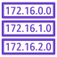|
|`!include <awslib/NetworkingAndContentDelivery/VPCFlowLogs.puml>`|`VPCFlowLogs`||
|`!include <awslib/NetworkingAndContentDelivery/VPCNATGateway.puml>`|`VPCNATGateway`||
|`!include <awslib/NetworkingAndContentDelivery/SitetoSiteVPN.puml>`|`SitetoSiteVPN`||
|`!include <awslib/NetworkingAndContentDelivery/CloudFrontDownloadDistribution.puml>`|`CloudFrontDownloadDistribution`||
|`!include <awslib/NetworkingAndContentDelivery/Route53HostedZone.puml>`|`Route53HostedZone`||
|`!include <awslib/NetworkingAndContentDelivery/CloudFrontStreamingDistribution.puml>`|`CloudFrontStreamingDistribution`||
|`!include <awslib/NetworkingAndContentDelivery/VPCInternetGateway.puml>`|`VPCInternetGateway`||
|`!include <awslib/NetworkingAndContentDelivery/ELBApplicationLoadBalancer.puml>`|`ELBApplicationLoadBalancer`||
|`!include <awslib/NetworkingAndContentDelivery/VPCVPNGateway.puml>`|`VPCVPNGateway`||
|`!include <awslib/NetworkingAndContentDelivery/GlobalAccelerator.puml>`|`GlobalAccelerator`||
|`!include <awslib/NetworkingAndContentDelivery/NetworkingandContentDelivery.puml>`|`NetworkingandContentDelivery`||
|`!include <awslib/NetworkingAndContentDelivery/VPCVPNConnection.puml>`|`VPCVPNConnection`||
|`!include <awslib/NetworkingAndContentDelivery/ClientVPN.puml>`|`ClientVPN`||
|`!include <awslib/NetworkingAndContentDelivery/ElasticLoadBalancing.puml>`|`ElasticLoadBalancing`||
|`!include <awslib/NetworkingAndContentDelivery/CloudMap.puml>`|`CloudMap`||
|`!include <awslib/NetworkingAndContentDelivery/VPCPeering.puml>`|`VPCPeering`||
|`!include <awslib/NetworkingAndContentDelivery/VPCCustomerGateway.puml>`|`VPCCustomerGateway`||
|`!include <awslib/NetworkingAndContentDelivery/CloudFrontEdgeLocation.puml>`|`CloudFrontEdgeLocation`||
|`!include <awslib/NetworkingAndContentDelivery/ClassicLoadBalancer.puml>`|`ClassicLoadBalancer`||
|`!include <awslib/NetworkingAndContentDelivery/CloudFront.puml>`|`CloudFront`||
|`!include <awslib/NetworkingAndContentDelivery/TransitGateway.puml>`|`TransitGateway`||
|`!include <awslib/NetworkingAndContentDelivery/PrivateLink.puml>`|`PrivateLink`||
|`!include <awslib/NetworkingAndContentDelivery/VPCNetworkAccessControlList.puml>`|`VPCNetworkAccessControlList`||
|`!include <awslib/NetworkingAndContentDelivery/ELBNetworkLoadBalancer.puml>`|`ELBNetworkLoadBalancer`||
|`!include <awslib/NetworkingAndContentDelivery/VPC.puml>`|`VPC`||
|`!include <awslib/Robotics/RoboMakerDevEnvironment.puml>`|`RoboMakerDevEnvironment`||
|`!include <awslib/Robotics/Robotics.puml>`|`Robotics`||
|`!include <awslib/Robotics/RoboMakerFleetManagement.puml>`|`RoboMakerFleetManagement`||
|`!include <awslib/Robotics/RoboMakerCloudExtensionROS.puml>`|`RoboMakerCloudExtensionROS`||
|`!include <awslib/Robotics/RoboMaker.puml>`|`RoboMaker`||
|`!include <awslib/Robotics/RoboMakerSimulation.puml>`|`RoboMakerSimulation`||
|`!include <awslib/AWSCostManagement/Budgets.puml>`|`Budgets`||
|`!include <awslib/AWSCostManagement/CostandUsageReport.puml>`|`CostandUsageReport`||
|`!include <awslib/AWSCostManagement/CostExplorer.puml>`|`CostExplorer`||
|`!include <awslib/AWSCostManagement/CostManagement.puml>`|`CostManagement`||
|`!include <awslib/AWSCostManagement/ReservedInstanceReporting.puml>`|`ReservedInstanceReporting`||
|`!include <awslib/SecurityIdentityAndCompliance/SecretsManager.puml>`|`SecretsManager`||
|`!include <awslib/SecurityIdentityAndCompliance/IAMAddon.puml>`|`IAMAddon`||
|`!include <awslib/SecurityIdentityAndCompliance/IAMDataEncryptionKey.puml>`|`IAMDataEncryptionKey`||
|`!include <awslib/SecurityIdentityAndCompliance/IAMPermissions.puml>`|`IAMPermissions`||
|`!include <awslib/SecurityIdentityAndCompliance/WAF.puml>`|`WAF`||
|`!include <awslib/SecurityIdentityAndCompliance/IAMMFAToken.puml>`|`IAMMFAToken`||
|`!include <awslib/SecurityIdentityAndCompliance/IAMResource.puml>`|`IAMResource`||
|`!include <awslib/SecurityIdentityAndCompliance/FirewallManager.puml>`|`FirewallManager`||
|`!include <awslib/SecurityIdentityAndCompliance/InspectorAgent.puml>`|`InspectorAgent`||
|`!include <awslib/SecurityIdentityAndCompliance/Macie.puml>`|`Macie`||
|`!include <awslib/SecurityIdentityAndCompliance/GuardDuty.puml>`|`GuardDuty`||
|`!include <awslib/SecurityIdentityAndCompliance/CertificateAuthority.puml>`|`CertificateAuthority`||
|`!include <awslib/SecurityIdentityAndCompliance/Inspector.puml>`|`Inspector`||
|`!include <awslib/SecurityIdentityAndCompliance/SecurityHub.puml>`|`SecurityHub`||
|`!include <awslib/SecurityIdentityAndCompliance/IAMRole.puml>`|`IAMRole`||
|`!include <awslib/SecurityIdentityAndCompliance/SingleSignOn.puml>`|`SingleSignOn`||
|`!include <awslib/SecurityIdentityAndCompliance/CloudDirectory.puml>`|`CloudDirectory`||
|`!include <awslib/SecurityIdentityAndCompliance/DirectoryService.puml>`|`DirectoryService`||
|`!include <awslib/SecurityIdentityAndCompliance/IAMTemporarySecurityCredential.puml>`|`IAMTemporarySecurityCredential`||
|`!include <awslib/SecurityIdentityAndCompliance/CertificateManager.puml>`|`CertificateManager`||
|`!include <awslib/SecurityIdentityAndCompliance/Shield.puml>`|`Shield`||
|`!include <awslib/SecurityIdentityAndCompliance/CloudHSM.puml>`|`CloudHSM`||
|`!include <awslib/SecurityIdentityAndCompliance/IAMLongtermSecurityCredential.puml>`|`IAMLongtermSecurityCredential`||
|`!include <awslib/SecurityIdentityAndCompliance/ManagedMicrosoftAD.puml>`|`ManagedMicrosoftAD`||
|`!include <awslib/SecurityIdentityAndCompliance/SecIdentityAndCompliance.puml>`|`SecIdentityAndCompliance`||
|`!include <awslib/SecurityIdentityAndCompliance/IAMAWSSTSAlternate.puml>`|`IAMAWSSTSAlternate`||
|`!include <awslib/SecurityIdentityAndCompliance/ShieldShieldAdvanced.puml>`|`ShieldShieldAdvanced`||
|`!include <awslib/SecurityIdentityAndCompliance/WAFFilteringrule.puml>`|`WAFFilteringrule`||
|`!include <awslib/SecurityIdentityAndCompliance/IAMEncryptedData.puml>`|`IAMEncryptedData`||
|`!include <awslib/SecurityIdentityAndCompliance/Cognito.puml>`|`Cognito`||
|`!include <awslib/SecurityIdentityAndCompliance/ADConnector.puml>`|`ADConnector`||
|`!include <awslib/SecurityIdentityAndCompliance/Artifact.puml>`|`Artifact`||
|`!include <awslib/SecurityIdentityAndCompliance/KeyManagementService.puml>`|`KeyManagementService`||
|`!include <awslib/SecurityIdentityAndCompliance/ResourceAccessManager.puml>`|`ResourceAccessManager`||
|`!include <awslib/SecurityIdentityAndCompliance/IAMAWSSTS.puml>`|`IAMAWSSTS`||
|`!include <awslib/SecurityIdentityAndCompliance/SimpleAD.puml>`|`SimpleAD`||
|`!include <awslib/ManagementAndGovernance/CloudWatchRule.puml>`|`CloudWatchRule`||
|`!include <awslib/ManagementAndGovernance/TrustedAdvisorCheckSecurity.puml>`|`TrustedAdvisorCheckSecurity`||
|`!include <awslib/ManagementAndGovernance/CloudWatch.puml>`|`CloudWatch`||
|`!include <awslib/ManagementAndGovernance/SystemsManagerDocuments.puml>`|`SystemsManagerDocuments`||
|`!include <awslib/ManagementAndGovernance/AutoScaling.puml>`|`AutoScaling`||
|`!include <awslib/ManagementAndGovernance/OpsWorksResources.puml>`|`OpsWorksResources`||
|`!include <awslib/ManagementAndGovernance/CloudFormation.puml>`|`CloudFormation`||
|`!include <awslib/ManagementAndGovernance/TrustedAdvisorCheckCost.puml>`|`TrustedAdvisorCheckCost`||
|`!include <awslib/ManagementAndGovernance/CloudFormationChangeSet.puml>`|`CloudFormationChangeSet`||
|`!include <awslib/ManagementAndGovernance/ControlTower.puml>`|`ControlTower`||
|`!include <awslib/ManagementAndGovernance/SystemsManager.puml>`|`SystemsManager`||
|`!include <awslib/ManagementAndGovernance/CloudWatchEventTimeBased.puml>`|`CloudWatchEventTimeBased`||
|`!include <awslib/ManagementAndGovernance/TrustedAdvisorCheckPerformance.puml>`|`TrustedAdvisorCheckPerformance`||
|`!include <awslib/ManagementAndGovernance/SystemsManagerStateManager.puml>`|`SystemsManagerStateManager`||
|`!include <awslib/ManagementAndGovernance/OpsWorks.puml>`|`OpsWorks`||
|`!include <awslib/ManagementAndGovernance/ManagementandGovernance.puml>`|`ManagementandGovernance`||
|`!include <awslib/ManagementAndGovernance/OrganizationsOrganizationalunit.puml>`|`OrganizationsOrganizationalunit`||
|`!include <awslib/ManagementAndGovernance/SystemsManagerPatchManager.puml>`|`SystemsManagerPatchManager`||
|`!include <awslib/ManagementAndGovernance/Organizations.puml>`|`Organizations`||
|`!include <awslib/ManagementAndGovernance/CloudFormationTemplate.puml>`|`CloudFormationTemplate`||
|`!include <awslib/ManagementAndGovernance/SystemsManagerInventory.puml>`|`SystemsManagerInventory`|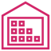|
|`!include <awslib/ManagementAndGovernance/OpsWorksMonitoring.puml>`|`OpsWorksMonitoring`||
|`!include <awslib/ManagementAndGovernance/SystemsManagerOpsCenter.puml>`|`SystemsManagerOpsCenter`||
|`!include <awslib/ManagementAndGovernance/Config.puml>`|`Config`||
|`!include <awslib/ManagementAndGovernance/PersonalHealthDashboard.puml>`|`PersonalHealthDashboard`||
|`!include <awslib/ManagementAndGovernance/ManagementConsole.puml>`|`ManagementConsole`||
|`!include <awslib/ManagementAndGovernance/SystemsManagerAutomation.puml>`|`SystemsManagerAutomation`||
|`!include <awslib/ManagementAndGovernance/OrganizationsAccount.puml>`|`OrganizationsAccount`||
|`!include <awslib/ManagementAndGovernance/SystemsManagerMaintWindows.puml>`|`SystemsManagerMaintWindows`||
|`!include <awslib/ManagementAndGovernance/SystemsManagerRunCommand.puml>`|`SystemsManagerRunCommand`||
|`!include <awslib/ManagementAndGovernance/OpsWorksPermissions.puml>`|`OpsWorksPermissions`||
|`!include <awslib/ManagementAndGovernance/OpsWorksDeployments.puml>`|`OpsWorksDeployments`|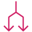|
|`!include <awslib/ManagementAndGovernance/OpsWorksLayers.puml>`|`OpsWorksLayers`||
|`!include <awslib/ManagementAndGovernance/CloudTrail.puml>`|`CloudTrail`||
|`!include <awslib/ManagementAndGovernance/SystemsManagerParameterStore.puml>`|`SystemsManagerParameterStore`||
|`!include <awslib/ManagementAndGovernance/ManagedServices.puml>`|`ManagedServices`||
|`!include <awslib/ManagementAndGovernance/LicenseManager.puml>`|`LicenseManager`||
|`!include <awslib/ManagementAndGovernance/WellArchitectedTool.puml>`|`WellArchitectedTool`||
|`!include <awslib/ManagementAndGovernance/CloudWatchAlarm.puml>`|`CloudWatchAlarm`||
|`!include <awslib/ManagementAndGovernance/OpsWorksApps.puml>`|`OpsWorksApps`||
|`!include <awslib/ManagementAndGovernance/OpsWorksStack2.puml>`|`OpsWorksStack2`||
|`!include <awslib/ManagementAndGovernance/CloudWatchEventEventBased.puml>`|`CloudWatchEventEventBased`||
|`!include <awslib/ManagementAndGovernance/CloudFormationStack.puml>`|`CloudFormationStack`||
|`!include <awslib/ManagementAndGovernance/TrustedAdvisor.puml>`|`TrustedAdvisor`||
|`!include <awslib/ManagementAndGovernance/OpsWorksInstances.puml>`|`OpsWorksInstances`||
|`!include <awslib/ManagementAndGovernance/TrustedAdvisorCheckFaultTolerant.puml>`|`TrustedAdvisorCheckFaultTolerant`||
|`!include <awslib/ManagementAndGovernance/TrustedAdvisorChecklist.puml>`|`TrustedAdvisorChecklist`||
|`!include <awslib/ManagementAndGovernance/ServiceCatalog.puml>`|`ServiceCatalog`||
|`!include <awslib/MachineLearning/SageMakerNotebook.puml>`|`SageMakerNotebook`||
|`!include <awslib/MachineLearning/Personalize.puml>`|`Personalize`||
|`!include <awslib/MachineLearning/RekognitionImage.puml>`|`RekognitionImage`||
|`!include <awslib/MachineLearning/TensorFlowonAWS.puml>`|`TensorFlowonAWS`||
|`!include <awslib/MachineLearning/MachineLearning.puml>`|`MachineLearning`||
|`!include <awslib/MachineLearning/ElasticInference.puml>`|`ElasticInference`||
|`!include <awslib/MachineLearning/Translate.puml>`|`Translate`||
|`!include <awslib/MachineLearning/Polly.puml>`|`Polly`||
|`!include <awslib/MachineLearning/DeepRacer.puml>`|`DeepRacer`||
|`!include <awslib/MachineLearning/SageMaker.puml>`|`SageMaker`||
|`!include <awslib/MachineLearning/DeepLens.puml>`|`DeepLens`||
|`!include <awslib/MachineLearning/RekognitionVideo.puml>`|`RekognitionVideo`||
|`!include <awslib/MachineLearning/SageMakerTrain.puml>`|`SageMakerTrain`||
|`!include <awslib/MachineLearning/SageMakerGroundTruth.puml>`|`SageMakerGroundTruth`||
|`!include <awslib/MachineLearning/Transcribe.puml>`|`Transcribe`||
|`!include <awslib/MachineLearning/SageMakerModel.puml>`|`SageMakerModel`||
|`!include <awslib/MachineLearning/Textract.puml>`|`Textract`||
|`!include <awslib/MachineLearning/ApacheMXNetonAWS.puml>`|`ApacheMXNetonAWS`||
|`!include <awslib/MachineLearning/DeepLearningContainers.puml>`|`DeepLearningContainers`||
|`!include <awslib/MachineLearning/Comprehend.puml>`|`Comprehend`||
|`!include <awslib/MachineLearning/DeepLearningAMIs.puml>`|`DeepLearningAMIs`||
|`!include <awslib/MachineLearning/Forecast.puml>`|`Forecast`||
|`!include <awslib/MachineLearning/Rekognition.puml>`|`Rekognition`||
|`!include <awslib/MachineLearning/Lex.puml>`|`Lex`||
|`!include <awslib/Storage/FSx.puml>`|`FSx`||
|`!include <awslib/Storage/EFSStandard.puml>`|`EFSStandard`||
|`!include <awslib/Storage/Backup.puml>`|`Backup`||
|`!include <awslib/Storage/SnowFamilyImportExport.puml>`|`SnowFamilyImportExport`||
|`!include <awslib/Storage/StorageGatewayVirtualTapeLibrary.puml>`|`StorageGatewayVirtualTapeLibrary`||
|`!include <awslib/Storage/EFSInfrequentAccess.puml>`|`EFSInfrequentAccess`||
|`!include <awslib/Storage/FSxforWindowsFileServer.puml>`|`FSxforWindowsFileServer`||
|`!include <awslib/Storage/S3Bucket.puml>`|`S3Bucket`||
|`!include <awslib/Storage/S3GlacierVault.puml>`|`S3GlacierVault`||
|`!include <awslib/Storage/StorageGatewayNonCachedVolume.puml>`|`StorageGatewayNonCachedVolume`||
|`!include <awslib/Storage/S3BucketwithObjects.puml>`|`S3BucketwithObjects`||
|`!include <awslib/Storage/StorageGatewayCachedVolume.puml>`|`StorageGatewayCachedVolume`||
|`!include <awslib/Storage/S3Glacier.puml>`|`S3Glacier`||
|`!include <awslib/Storage/ElasticFileSystemEFS.puml>`|`ElasticFileSystemEFS`||
|`!include <awslib/Storage/ElasticBlockStoreEBS.puml>`|`ElasticBlockStoreEBS`||
|`!include <awslib/Storage/SimpleStorageServiceS3.puml>`|`SimpleStorageServiceS3`||
|`!include <awslib/Storage/S3Object.puml>`|`S3Object`||
|`!include <awslib/Storage/EBSSnapshot.puml>`|`EBSSnapshot`||
|`!include <awslib/Storage/EFSFilesystem.puml>`|`EFSFilesystem`||
|`!include <awslib/Storage/FSxforLustre.puml>`|`FSxforLustre`||
|`!include <awslib/Storage/Storage.puml>`|`Storage`||
|`!include <awslib/Storage/EBSVolume.puml>`|`EBSVolume`||
|`!include <awslib/Storage/S3GlacierArchive.puml>`|`S3GlacierArchive`||
|`!include <awslib/Storage/StorageGateway.puml>`|`StorageGateway`||
|`!include <awslib/Blockchain/QuantumLedgerDatabaseQLDB.puml>`|`QuantumLedgerDatabaseQLDB`||
|`!include <awslib/Blockchain/Blockchain.puml>`|`Blockchain`||
|`!include <awslib/Blockchain/ManagedBlockchain.puml>`|`ManagedBlockchain`||
|`!include <awslib/GameTech/GameLift.puml>`|`GameLift`||
|`!include <awslib/GameTech/GameTech.puml>`|`GameTech`||
|`!include <awslib/GroupIcons/AutoScalingGroup.puml>`|`AutoScalingGroup`||
|`!include <awslib/GroupIcons/VirtualPrivateCloudVPC.puml>`|`VirtualPrivateCloudVPC`||
|`!include <awslib/GroupIcons/CorporateDataCenter.puml>`|`CorporateDataCenter`||
|`!include <awslib/GroupIcons/VPCSubnetPublic.puml>`|`VPCSubnetPublic`||
|`!include <awslib/GroupIcons/ServerContents.puml>`|`ServerContents`||
|`!include <awslib/GroupIcons/Cloud.puml>`|`Cloud`||
|`!include <awslib/GroupIcons/Cloudalt.puml>`|`Cloudalt`||
|`!include <awslib/GroupIcons/StepFunction.puml>`|`StepFunction`||
|`!include <awslib/GroupIcons/SpotFleet.puml>`|`SpotFleet`||
|`!include <awslib/GroupIcons/VPCSubnetPrivate.puml>`|`VPCSubnetPrivate`||
|`!include <awslib/GroupIcons/ElasticBeanstalkContainer.puml>`|`ElasticBeanstalkContainer`||
|`!include <awslib/GroupIcons/Region.puml>`|`Region`||
|`!include <awslib/Compute/EC2H1Instance.puml>`|`EC2H1Instance`||
|`!include <awslib/Compute/EC2M4Instance.puml>`|`EC2M4Instance`||
|`!include <awslib/Compute/EC2ElasticIPAddress.puml>`|`EC2ElasticIPAddress`|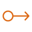|
|`!include <awslib/Compute/EC2I3Instance.puml>`|`EC2I3Instance`||
|`!include <awslib/Compute/EC2HighMemoryInstance.puml>`|`EC2HighMemoryInstance`||
|`!include <awslib/Compute/ElasticContainerService.puml>`|`ElasticContainerService`||
|`!include <awslib/Compute/EC2M5Instance.puml>`|`EC2M5Instance`||
|`!include <awslib/Compute/EC2C5nInstance.puml>`|`EC2C5nInstance`||
|`!include <awslib/Compute/ECSContainer2.puml>`|`ECSContainer2`||
|`!include <awslib/Compute/EC2R5aInstance.puml>`|`EC2R5aInstance`||
|`!include <awslib/Compute/EC2C5Instance.puml>`|`EC2C5Instance`||
|`!include <awslib/Compute/ThinkboxSequoia.puml>`|`ThinkboxSequoia`||
|`!include <awslib/Compute/ElasticBeanstalkApplication.puml>`|`ElasticBeanstalkApplication`||
|`!include <awslib/Compute/Fargate.puml>`|`Fargate`||
|`!include <awslib/Compute/EC2R5Instance.puml>`|`EC2R5Instance`||
|`!include <awslib/Compute/ThinkboxKrakatoa.puml>`|`ThinkboxKrakatoa`||
|`!include <awslib/Compute/EC2ContainerRegistryResource.puml>`|`EC2ContainerRegistryResource`||
|`!include <awslib/Compute/EC2A1Instance.puml>`|`EC2A1Instance`||
|`!include <awslib/Compute/EC2Rescue.puml>`|`EC2Rescue`||
|`!include <awslib/Compute/EC2C4Instance.puml>`|`EC2C4Instance`||
|`!include <awslib/Compute/EC2F1Instance.puml>`|`EC2F1Instance`||
|`!include <awslib/Compute/ThinkboxXMesh.puml>`|`ThinkboxXMesh`||
|`!include <awslib/Compute/ElasticBeanstalkDeployment.puml>`|`ElasticBeanstalkDeployment`||
|`!include <awslib/Compute/EC2G3Instance.puml>`|`EC2G3Instance`||
|`!include <awslib/Compute/EC2R4Instance.puml>`|`EC2R4Instance`|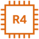|
|`!include <awslib/Compute/EC2D2Instance.puml>`|`EC2D2Instance`|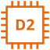|
|`!include <awslib/Compute/ECSContainer3.puml>`|`ECSContainer3`||
|`!include <awslib/Compute/EC2DBonInstance.puml>`|`EC2DBonInstance`||
|`!include <awslib/Compute/EC2P2Instance.puml>`|`EC2P2Instance`|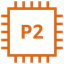|
|`!include <awslib/Compute/EC2AutoScalingResource.puml>`|`EC2AutoScalingResource`||
|`!include <awslib/Compute/EC2T2Instance.puml>`|`EC2T2Instance`|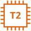|
|`!include <awslib/Compute/EC2SpotInstance.puml>`|`EC2SpotInstance`||
|`!include <awslib/Compute/ThinkboxDraft.puml>`|`ThinkboxDraft`||
|`!include <awslib/Compute/EC2AutoScaling.puml>`|`EC2AutoScaling`||
|`!include <awslib/Compute/EC2ContainerRegistry.puml>`|`EC2ContainerRegistry`||
|`!include <awslib/Compute/EC2OptimizedInstance.puml>`|`EC2OptimizedInstance`||
|`!include <awslib/Compute/VMwareCloudOnAWS.puml>`|`VMwareCloudOnAWS`||
|`!include <awslib/Compute/EC2T3Instance.puml>`|`EC2T3Instance`|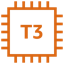|
|`!include <awslib/Compute/ThinkboxDeadline.puml>`|`ThinkboxDeadline`||
|`!include <awslib/Compute/EC2P3Instance.puml>`|`EC2P3Instance`||
|`!include <awslib/Compute/EC2z1dInstance.puml>`|`EC2z1dInstance`||
|`!include <awslib/Compute/EC2Instance.puml>`|`EC2Instance`||
|`!include <awslib/Compute/ThinkboxStoke.puml>`|`ThinkboxStoke`||
|`!include <awslib/Compute/Batch.puml>`|`Batch`||
|`!include <awslib/Compute/ServerlessApplicationRepository.puml>`|`ServerlessApplicationRepository`||
|`!include <awslib/Compute/EC2.puml>`|`EC2`||
|`!include <awslib/Compute/EC2T3aInstance.puml>`|`EC2T3aInstance`|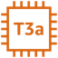|
|`!include <awslib/Compute/ECSContainer1.puml>`|`ECSContainer1`||
|`!include <awslib/Compute/EC2Instances.puml>`|`EC2Instances`||
|`!include <awslib/Compute/EC2InstancewithCloudWatch.puml>`|`EC2InstancewithCloudWatch`||
|`!include <awslib/Compute/ECSService.puml>`|`ECSService`||
|`!include <awslib/Compute/EC2ContainerRegistryImage.puml>`|`EC2ContainerRegistryImage`||
|`!include <awslib/Compute/Outposts.puml>`|`Outposts`||
|`!include <awslib/Compute/EC2AMI.puml>`|`EC2AMI`||
|`!include <awslib/Compute/ElasticKubernetesService.puml>`|`ElasticKubernetesService`||
|`!include <awslib/Compute/Lambda.puml>`|`Lambda`||
|`!include <awslib/Compute/EC2X1Instance.puml>`|`EC2X1Instance`||
|`!include <awslib/Compute/Compute.puml>`|`Compute`||
|`!include <awslib/Compute/Lightsail.puml>`|`Lightsail`||
|`!include <awslib/Compute/ThinkboxFrost.puml>`|`ThinkboxFrost`||
|`!include <awslib/Compute/ElasticBeanstalk.puml>`|`ElasticBeanstalk`||
|`!include <awslib/Compute/EC2X1eInstance.puml>`|`EC2X1eInstance`||
|`!include <awslib/Compute/EC2M5aInstance.puml>`|`EC2M5aInstance`||
|`!include <awslib/Compute/LambdaLambdaFunction.puml>`|`LambdaLambdaFunction`||
|`!include <awslib/InternetOfThings/IoTPoliceEmergency.puml>`|`IoTPoliceEmergency`||
|`!include <awslib/InternetOfThings/InternetofThings.puml>`|`InternetofThings`||
|`!include <awslib/InternetOfThings/IoTFactory.puml>`|`IoTFactory`||
|`!include <awslib/InternetOfThings/IoTAnalyticsDataStore.puml>`|`IoTAnalyticsDataStore`||
|`!include <awslib/InternetOfThings/IoTCoffeePot.puml>`|`IoTCoffeePot`||
|`!include <awslib/InternetOfThings/IoTAnalytics.puml>`|`IoTAnalytics`||
|`!include <awslib/InternetOfThings/IoTCertificateManager.puml>`|`IoTCertificateManager`||
|`!include <awslib/InternetOfThings/IoTDeviceDefender.puml>`|`IoTDeviceDefender`||
|`!include <awslib/InternetOfThings/IoTWindfarm.puml>`|`IoTWindfarm`|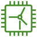|
|`!include <awslib/InternetOfThings/IoTGreengrassConnector.puml>`|`IoTGreengrassConnector`||
|`!include <awslib/InternetOfThings/IoTTravel.puml>`|`IoTTravel`||
|`!include <awslib/InternetOfThings/IoTAnalyticsDataSet.puml>`|`IoTAnalyticsDataSet`||
|`!include <awslib/InternetOfThings/IoTSiteWise.puml>`|`IoTSiteWise`||
|`!include <awslib/InternetOfThings/IoTAnalyticsPipeline.puml>`|`IoTAnalyticsPipeline`||
|`!include <awslib/InternetOfThings/IoTPolicy.puml>`|`IoTPolicy`||
|`!include <awslib/InternetOfThings/IoTSensor.puml>`|`IoTSensor`||
|`!include <awslib/InternetOfThings/IoTActuator.puml>`|`IoTActuator`||
|`!include <awslib/InternetOfThings/IoTEvents.puml>`|`IoTEvents`||
|`!include <awslib/InternetOfThings/IoTAction.puml>`|`IoTAction`||
|`!include <awslib/InternetOfThings/IoTBicycle.puml>`|`IoTBicycle`||
|`!include <awslib/InternetOfThings/IoTCore.puml>`|`IoTCore`||
|`!include <awslib/InternetOfThings/IoTMedicalEmergency.puml>`|`IoTMedicalEmergency`||
|`!include <awslib/InternetOfThings/IoTSimulator.puml>`|`IoTSimulator`||
|`!include <awslib/InternetOfThings/IoTThermostat.puml>`|`IoTThermostat`||
|`!include <awslib/InternetOfThings/IoTCamera.puml>`|`IoTCamera`||
|`!include <awslib/InternetOfThings/IoTLightbulb.puml>`|`IoTLightbulb`||
|`!include <awslib/InternetOfThings/IoTHouse.puml>`|`IoTHouse`||
|`!include <awslib/InternetOfThings/IoTCar.puml>`|`IoTCar`||
|`!include <awslib/InternetOfThings/IoTDeviceManagement.puml>`|`IoTDeviceManagement`||
|`!include <awslib/InternetOfThings/IoTMQTTProtocol.puml>`|`IoTMQTTProtocol`||
|`!include <awslib/InternetOfThings/IoTAlexaEnabledDevice.puml>`|`IoTAlexaEnabledDevice`||
|`!include <awslib/InternetOfThings/IoTOverTheAirUpdate.puml>`|`IoTOverTheAirUpdate`||
|`!include <awslib/InternetOfThings/IoTFireTV.puml>`|`IoTFireTV`||
|`!include <awslib/InternetOfThings/IoTShadow.puml>`|`IoTShadow`||
|`!include <awslib/InternetOfThings/IoTHTTP2Protocol.puml>`|`IoTHTTP2Protocol`||
|`!include <awslib/InternetOfThings/IoTThingsGraph.puml>`|`IoTThingsGraph`||
|`!include <awslib/InternetOfThings/IoTUtility.puml>`|`IoTUtility`||
|`!include <awslib/InternetOfThings/IoTGeneric.puml>`|`IoTGeneric`||
|`!include <awslib/InternetOfThings/IoTDeviceGateway.puml>`|`IoTDeviceGateway`||
|`!include <awslib/InternetOfThings/IoT1Click.puml>`|`IoT1Click`||
|`!include <awslib/InternetOfThings/IoTFireTVStick.puml>`|`IoTFireTVStick`||
|`!include <awslib/InternetOfThings/IoTAlexaSkill.puml>`|`IoTAlexaSkill`||
|`!include <awslib/InternetOfThings/IoTServo.puml>`|`IoTServo`||
|`!include <awslib/InternetOfThings/IoTButton.puml>`|`IoTButton`||
|`!include <awslib/InternetOfThings/IoTBank.puml>`|`IoTBank`||
|`!include <awslib/InternetOfThings/IoTAnalyticsChannel.puml>`|`IoTAnalyticsChannel`||
|`!include <awslib/InternetOfThings/IoTCart.puml>`|`IoTCart`||
|`!include <awslib/InternetOfThings/IoTHardwareBoard.puml>`|`IoTHardwareBoard`||
|`!include <awslib/InternetOfThings/IoTHTTPProtocol.puml>`|`IoTHTTPProtocol`||
|`!include <awslib/InternetOfThings/IoTEcho.puml>`|`IoTEcho`||
|`!include <awslib/InternetOfThings/FreeRTOS.puml>`|`FreeRTOS`||
|`!include <awslib/InternetOfThings/IoTAnalyticsNotebook.puml>`|`IoTAnalyticsNotebook`||
|`!include <awslib/InternetOfThings/IoTLambdaFunction.puml>`|`IoTLambdaFunction`||
|`!include <awslib/InternetOfThings/IoTRule.puml>`|`IoTRule`||
|`!include <awslib/InternetOfThings/IoTDoorLock.puml>`|`IoTDoorLock`||
|`!include <awslib/InternetOfThings/IoTDesiredState.puml>`|`IoTDesiredState`||
|`!include <awslib/InternetOfThings/IoTGreengrass.puml>`|`IoTGreengrass`||
|`!include <awslib/InternetOfThings/IoTAlexaVoiceService.puml>`|`IoTAlexaVoiceService`||
|`!include <awslib/InternetOfThings/IoTReportedState.puml>`|`IoTReportedState`||
|`!include <awslib/InternetOfThings/IoTTopic.puml>`|`IoTTopic`||
|`!include <awslib/Mobile/Mobile.puml>`|`Mobile`||
|`!include <awslib/Mobile/APIGateway.puml>`|`APIGateway`||
|`!include <awslib/Mobile/AppSync2.puml>`|`AppSync2`||
|`!include <awslib/Mobile/DeviceFarm.puml>`|`DeviceFarm`||
|`!include <awslib/Mobile/APIGatewayEndpoint.puml>`|`APIGatewayEndpoint`||
|`!include <awslib/Mobile/Amplify.puml>`|`Amplify`||
|`!include <awslib/Satellite/Satellite.puml>`|`Satellite`||
|`!include <awslib/Satellite/GroundStation.puml>`|`GroundStation`||
|`!include <awslib/MediaServices/ElementalMediaPackage.puml>`|`ElementalMediaPackage`||
|`!include <awslib/MediaServices/ElementalMediaStore.puml>`|`ElementalMediaStore`||
|`!include <awslib/MediaServices/ElementalMediaLive.puml>`|`ElementalMediaLive`||
|`!include <awslib/MediaServices/ElementalMediaTailor.puml>`|`ElementalMediaTailor`||
|`!include <awslib/MediaServices/ElementalMediaConvert.puml>`|`ElementalMediaConvert`||
|`!include <awslib/MediaServices/ElementalMediaConnect.puml>`|`ElementalMediaConnect`||
|`!include <awslib/MediaServices/ElasticTranscoder.puml>`|`ElasticTranscoder`||
|`!include <awslib/MediaServices/MediaServices.puml>`|`MediaServices`||
|`!include <awslib/EndUserComputing/EndUserComputing.puml>`|`EndUserComputing`||
|`!include <awslib/EndUserComputing/Workspaces.puml>`|`Workspaces`||
|`!include <awslib/EndUserComputing/WorkLink.puml>`|`WorkLink`||
|`!include <awslib/EndUserComputing/WorkDocs.puml>`|`WorkDocs`||
|`!include <awslib/EndUserComputing/Appstream2.0.puml>`|`Appstream2.0`||
|`!include <awslib/MigrationAndTransfer/ApplicationDiscoveryService.puml>`|`ApplicationDiscoveryService`||
|`!include <awslib/MigrationAndTransfer/DataSync.puml>`|`DataSync`||
|`!include <awslib/MigrationAndTransfer/DataSyncAgent.puml>`|`DataSyncAgent`||
|`!include <awslib/MigrationAndTransfer/SnowballEdge.puml>`|`SnowballEdge`||
|`!include <awslib/MigrationAndTransfer/Snowmobile.puml>`|`Snowmobile`||
|`!include <awslib/MigrationAndTransfer/ServerMigrationService.puml>`|`ServerMigrationService`||
|`!include <awslib/MigrationAndTransfer/Snowball.puml>`|`Snowball`||
|`!include <awslib/MigrationAndTransfer/MigrationHub.puml>`|`MigrationHub`||
|`!include <awslib/MigrationAndTransfer/TransferforSFTP.puml>`|`TransferforSFTP`||
|`!include <awslib/MigrationAndTransfer/MigrationandTransfer.puml>`|`MigrationandTransfer`||
|`!include <awslib/BusinessApplications/BusinessApplications.puml>`|`BusinessApplications`||
|`!include <awslib/BusinessApplications/WorkMail.puml>`|`WorkMail`||
|`!include <awslib/BusinessApplications/AlexaForBusiness.puml>`|`AlexaForBusiness`||
|`!include <awslib/BusinessApplications/Chime.puml>`|`Chime`||
|`!include <awslib/ARVR/Sumerian.puml>`|`Sumerian`||
|`!include <awslib/ARVR/ARVR.puml>`|`ARVR`||
|`!include <awslib/DeveloperTools/DeveloperTools.puml>`|`DeveloperTools`||
|`!include <awslib/DeveloperTools/CodeDeploy.puml>`|`CodeDeploy`||
|`!include <awslib/DeveloperTools/ToolsAndSDKs.puml>`|`ToolsAndSDKs`||
|`!include <awslib/DeveloperTools/Cloud9.puml>`|`Cloud9`||
|`!include <awslib/DeveloperTools/CommandLineInterface.puml>`|`CommandLineInterface`||
|`!include <awslib/DeveloperTools/CodeBuild.puml>`|`CodeBuild`||
|`!include <awslib/DeveloperTools/CloudDevelopmentKit.puml>`|`CloudDevelopmentKit`||
|`!include <awslib/DeveloperTools/CodeStar.puml>`|`CodeStar`||
|`!include <awslib/DeveloperTools/XRay.puml>`|`XRay`||
|`!include <awslib/DeveloperTools/CodeCommit.puml>`|`CodeCommit`||
|`!include <awslib/DeveloperTools/CodePipeline.puml>`|`CodePipeline`||
|`!include <awslib/ApplicationIntegration/SNSTopic.puml>`|`SNSTopic`||
|`!include <awslib/ApplicationIntegration/AppSync.puml>`|`AppSync`||
|`!include <awslib/ApplicationIntegration/EventBridge.puml>`|`EventBridge`||
|`!include <awslib/ApplicationIntegration/SQSMessage.puml>`|`SQSMessage`||
|`!include <awslib/ApplicationIntegration/ApplicationIntegration.puml>`|`ApplicationIntegration`||
|`!include <awslib/ApplicationIntegration/SQSQueue.puml>`|`SQSQueue`||
|`!include <awslib/ApplicationIntegration/StepFunctions.puml>`|`StepFunctions`||
|`!include <awslib/ApplicationIntegration/SNS.puml>`|`SNS`||
|`!include <awslib/ApplicationIntegration/MQ.puml>`|`MQ`||
|`!include <awslib/ApplicationIntegration/SNSEmailNotification.puml>`|`SNSEmailNotification`||
|`!include <awslib/ApplicationIntegration/SQS.puml>`|`SQS`||
|`!include <awslib/ApplicationIntegration/SNSHTTPNotification.puml>`|`SNSHTTPNotification`||
|`!include <awslib/Analytics/EMRCluster.puml>`|`EMRCluster`||
|`!include <awslib/Analytics/DenseComputeNodeResource.puml>`|`DenseComputeNodeResource`||
|`!include <awslib/Analytics/Analytics.puml>`|`Analytics`||
|`!include <awslib/Analytics/EMREngineMapRM7.puml>`|`EMREngineMapRM7`||
|`!include <awslib/Analytics/Athena.puml>`|`Athena`||
|`!include <awslib/Analytics/KinesisDataFirehose.puml>`|`KinesisDataFirehose`||
|`!include <awslib/Analytics/GlueDataCatalog.puml>`|`GlueDataCatalog`||
|`!include <awslib/Analytics/GlueCrawlers.puml>`|`GlueCrawlers`||
|`!include <awslib/Analytics/KinesisVideoStreams.puml>`|`KinesisVideoStreams`||
|`!include <awslib/Analytics/EMREngine.puml>`|`EMREngine`||
|`!include <awslib/Analytics/EMR.puml>`|`EMR`||
|`!include <awslib/Analytics/EMRHDFSCluster.puml>`|`EMRHDFSCluster`||
|`!include <awslib/Analytics/DatalakeResourceIcon.puml>`|`DatalakeResourceIcon`||
|`!include <awslib/Analytics/LakeFormation.puml>`|`LakeFormation`||
|`!include <awslib/Analytics/Glue.puml>`|`Glue`||
|`!include <awslib/Analytics/CloudSearch.puml>`|`CloudSearch`||
|`!include <awslib/Analytics/ElasticsearchService.puml>`|`ElasticsearchService`||
|`!include <awslib/Analytics/EMREngineMapRM5.puml>`|`EMREngineMapRM5`||
|`!include <awslib/Analytics/DataPipeline.puml>`|`DataPipeline`||
|`!include <awslib/Analytics/KinesisDataAnalytics.puml>`|`KinesisDataAnalytics`||
|`!include <awslib/Analytics/Kinesis.puml>`|`Kinesis`||
|`!include <awslib/Analytics/KinesisDataStreams.puml>`|`KinesisDataStreams`||
|`!include <awslib/Analytics/ManagedStreamingforKafka.puml>`|`ManagedStreamingforKafka`||
|`!include <awslib/Analytics/Redshift.puml>`|`Redshift`||
|`!include <awslib/Analytics/QuickSight.puml>`|`QuickSight`||
|`!include <awslib/Analytics/DenseStorageNodeResource.puml>`|`DenseStorageNodeResource`||
|`!include <awslib/Analytics/CloudSearchSearchDocuments.puml>`|`CloudSearchSearchDocuments`||
|`!include <awslib/Analytics/EMREEngineMapRM3.puml>`|`EMREEngineMapRM3`||
